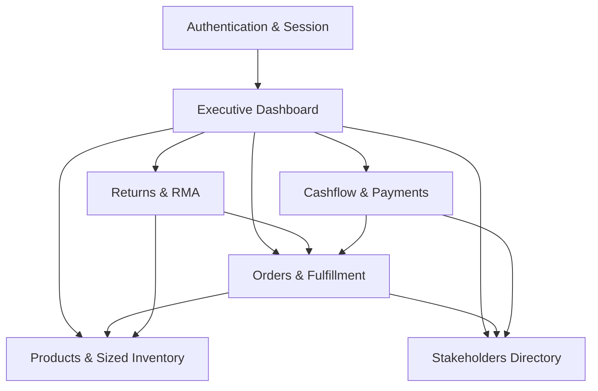
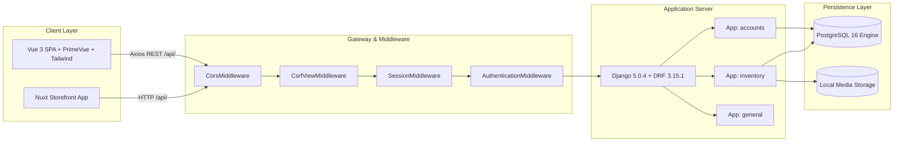
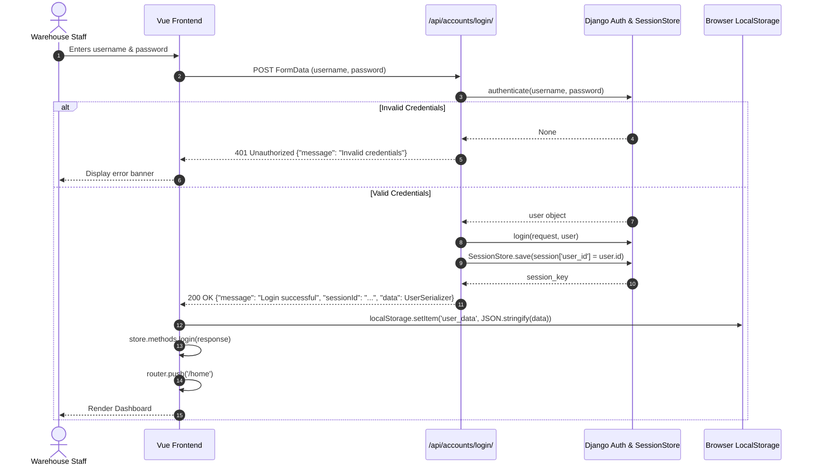
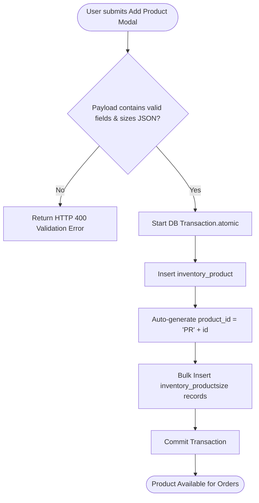
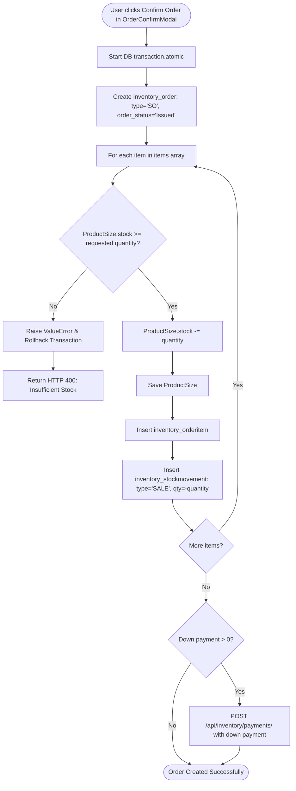
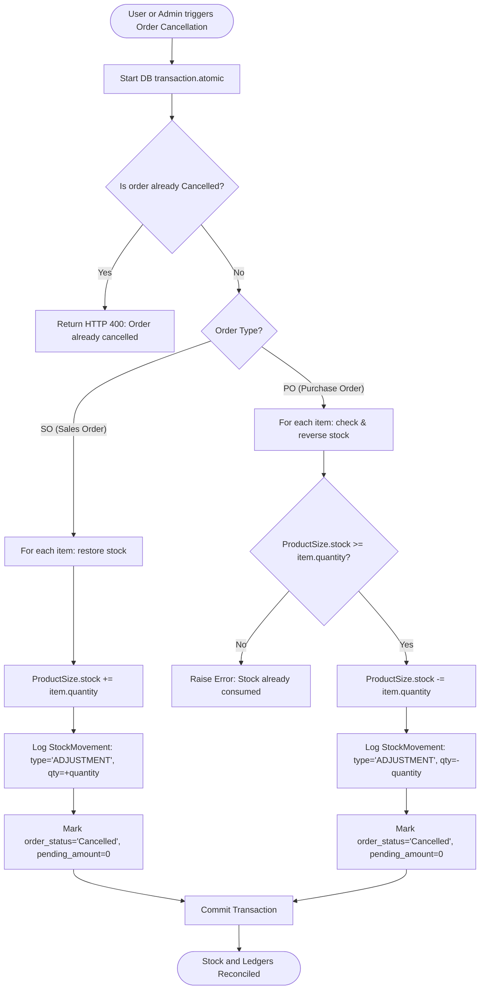
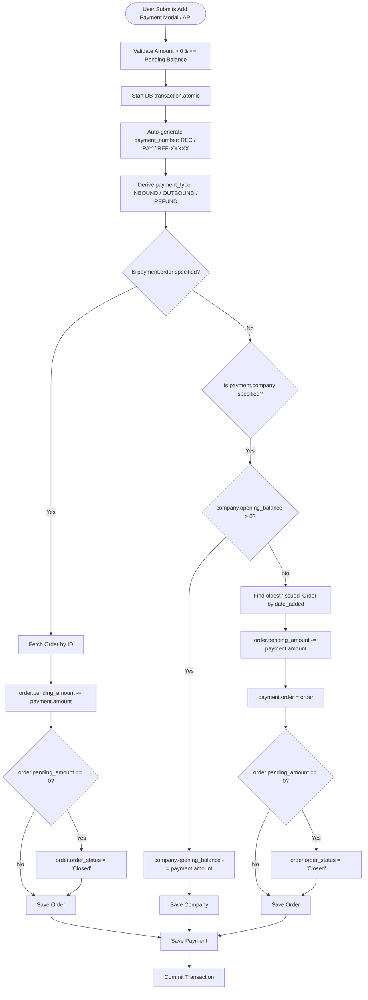
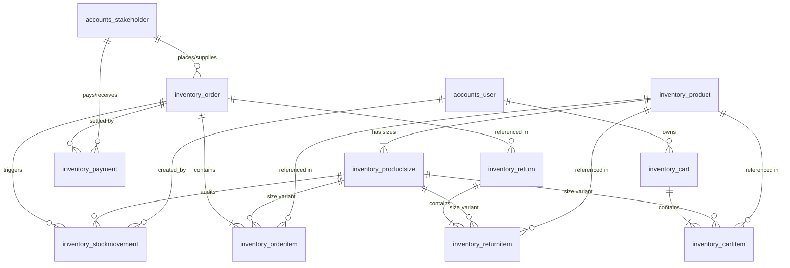
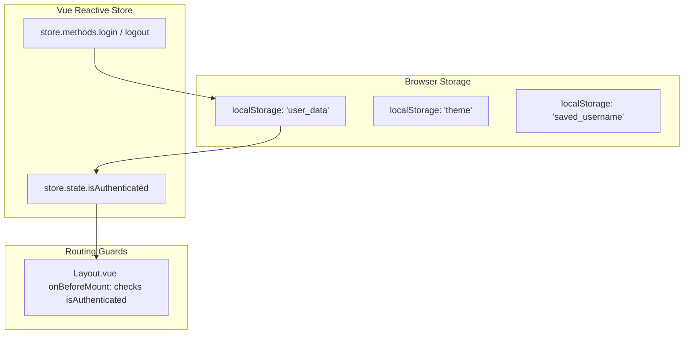

# CoreWMS - Warehouse Management System (WMS)
## Master Technical Blueprint & Single Source of Truth

> **Document Status**: Authoritative Architecture Specification  
> **Target Audience**: Core Engineers, AI Agents, Technical Auditors, QA Automation Engineers  
> **System Release**: 2.0 (ERP Size-Based Inventory Edition)  
> **Repository Root**: `/home/ashiq/Desktop/warehouse-manage-system/wms-backend`  
> **Last Verified**: 2026-09-07  

---

## 1. Project Overview

### 1.1 System Purpose
CoreWMS is a full-stack, enterprise-style Warehouse Management System (WMS) designed to manage end-to-end inventory logistics, multi-size SKU stock availability, purchase order receiving (inbound logistics), sales order fulfillment (outbound logistics), return merchandise authorizations (RMA), and financial stakeholder account ledgers (Accounts Receivable & Accounts Payable).

### 1.2 Business Goals
1. **Single Source of Truth Inventory**: Eliminate stock discrepancies by treating size-level inventory (`ProductSize.stock`) as the sole authoritative balance, dynamically computing product-level stock (`Product.qty_available`).
2. **Comprehensive Audit Trail**: Record immutable, ERP-compliant stock movement transaction logs (`StockMovement`) for every stock receipt, dispatch, or return.
3. **Automated Debt Liquidation**: Automatically calculate and deduct outstanding liabilities via direct bill linkage or First-In, First-Out (FIFO) unallocated debt liquidation (`next_bill_to_clear`).
4. **Real-Time Operational Analytics**: Surface instant executive visibility into revenue, procurement expenditures, active receivables/payables, and stock levels.

### 1.3 Main Functional Modules


| Module | Core Responsibility | Key Models Involved |
| :--- | :--- | :--- |
| **Authentication & Accounts** | User login, session provision, staff profile management | `User`, `Stakeholder` |
| **Products & Inventory** | Multi-size SKU definitions, real-time stock balances, audit logging | `Product`, `ProductSize`, `StockMovement` |
| **Stakeholder Directory** | Customer & Supplier directories, credit tracking, opening balances | `Stakeholder` |
| **Orders & Fulfillment** | Purchase Orders (PO) and Sales Orders (SO) processing and validation | `Order`, `OrderItem` |
| **Returns & RMA** | Sales returns (customer to warehouse) and purchase returns (warehouse to supplier) | `Return`, `ReturnItem` |
| **Payments & Ledger** | Inbound customer receipts, supplier settlements, and FIFO bill allocation | `Payment` |
| **B2C Cart & Storefront** | Online customer product selection and ordering integration | `Cart`, `CartItem` |

### 1.4 User Roles & Access Hierarchy
* **Superuser / System Admin**: Full access to Django administrative dashboard (`/admin/`), raw database records, user creation, and configuration.
* **Warehouse Manager / Staff**: Authenticated operational user. Manages inventory stock levels, processes orders, records incoming shipments, accepts returns, and logs financial settlements.
* **Customer / Supplier (Stakeholder)**: External entities represented as records in `accounts_stakeholder`. They do not log into the staff admin panel; transactions are executed on their behalf by warehouse staff.
* **Storefront Customer**: Consumer entity interacting with the shopping cart (`Cart`, `CartItem`) through external or integrated web channels.

---

## 2. System Architecture



### 2.1 Frontend Architecture
* **Framework**: Vue 3 (v3.4.21) utilizing `<script setup lang="ts">` and Composition API.
* **Build System**: Vite (v5.2.8) with plugins:
  * `@vitejs/plugin-vue` (v5.0.4)
  * `vite-plugin-pages` (v0.32.3) for file-system based routing from `src/pages/`.
  * `vite-plugin-vue-layouts` (v0.11.0) for wrapper layout orchestration.
* **UI Component Library**: PrimeVue (v4.1.0) configured with the `@primevue/themes/aura` preset.
* **CSS Framework**: Tailwind CSS (v3.4.3) with `@layer tailwind-base, primevue, tailwind-utilities` in `src/style.css` and `darkMode: 'class'` selector.
* **State Management**:
  * Pinia (v2.1.7) registered in `src/main.js`.
  * Core Authentication State store in `src/stores/stores.js` backed by `localStorage` persistence (`user_data`).
* **HTTP Client**: Axios (v1.7.1) customized in `src/plugins/axios.js` with response interceptors and CSRF cookie binding.
* **Data Visualization**: ApexCharts (v5.10.0) via `vue3-apexcharts` (v1.7.0).
* **Page Meta & Title Management**: Centralized dynamic document title and meta tag resolver in `src/utils/meta.ts` with `vue-router` `afterEach` synchronization (`{PageTitle} | CoreWMS`), dynamic parameter hydration for detail records, and HTML SEO meta tags.

### 2.2 Backend Architecture
* **Runtime & Framework**: Python 3.10+, Django (v5.0.4), Django REST Framework (v3.15.1).
* **Base Architecture**: Model-View-Set / Model-Serializer pattern organized in modular Django apps:
  * `wms`: Project core settings, WSGI, ASGI, and root routing.
  * `general`: Abstract foundational models (`WebBaseModel`).
  * `accounts`: Custom User authentication and Stakeholder entity definitions.
  * `inventory`: Products, sizes, movements, orders, items, returns, payments, and cart models.
  * `api.v1.accounts`: REST endpoints, serializers, and views for authentication and stakeholders.
  * `api.v1.inventory`: REST endpoints, serializers, and viewsets for operations.
  * `frontmatter`: Hosts Django template (`frontmatter/index.html`) integrating `django_vite` to mount compiled Vue assets.
* **Static Assets**: WhiteNoise (v6.9.0) for production-grade static file serving.

### 2.3 Database Architecture
* **Primary Engine**: PostgreSQL 16 (configured in `wms/settings.py` via `psycopg2-binary` and orchestrated via Docker in `compose.yaml`).
* **Local Fallback/Development**: SQLite database file (`db.sqlite3`) supported via Django ORM.
* **Base Abstract Model (`general.models.WebBaseModel`)**:
  * Every major entity inherits `date_added` (auto-indexed timestamp), `date_updated` (auto-updating timestamp), and `is_deleted` (soft-deletion flag).

### 2.4 External Integrations
* **Django Vite (`django-vite`)**: Connects Django backend routing with the Vite frontend build server.
* **Storage**: Local filesystem media storage mounted at `/media/` via `django.conf.urls.static` for product imagery.

### 2.5 Authentication Flow


### 2.6 API Routing Structure
* `http://<host>:<port>/api/accounts/`:
  * `POST /login/`: Session login endpoint.
  * `GET|POST|PUT|PATCH|DELETE /stakeholders/`: ModelViewSet for Customer and Supplier entities.
* `http://<host>:<port>/api/inventory/`:
  * `GET|POST|PUT|PATCH|DELETE /orders/`: Order resource management.
  * `GET /orders/get_total_by_stakeholders/`: Aggregated pending payments per stakeholder.
  * `GET|POST|PUT|PATCH|DELETE /order-items/`: Order line items.
  * `GET|POST|PUT|PATCH|DELETE /products/`: Products catalog with nested sizes.
  * `GET|POST|PUT|PATCH|DELETE /returns/`: Returns management.
  * `GET|POST|PUT|PATCH|DELETE /return-items/`: Return line items.
  * `GET|POST|PUT|PATCH|DELETE /payments/`: Financial transactions and disbursements.
  * `GET|POST /cart/`: Storefront shopping cart.
  * `GET|POST|PUT|PATCH|DELETE /cart-items/`: Items in active shopping cart.

---

## 3. Module Inventory

### 3.1 Module: Authentication & Session Management
* **Purpose**: Verifies staff credentials, starts authenticated server sessions, and sets client state.
* **Entry Point**: Route `/login` in `src/router/index.js`.
* **Frontend Pages**: `src/components/auth/Login.vue`.
* **Services / State**: `src/plugins/axios.js`, `src/stores/stores.js`.
* **Backend Views**: `api/v1/accounts/views.py::LoginView`.
* **Endpoints Used**: `POST /api/accounts/login/`.
* **Database Tables**: `accounts_user`, `django_session`.

### 3.2 Module: Executive Dashboard
* **Purpose**: Displays real-time operational KPIs, inventory volumes, sales/procurement velocity, and receivables/payables.
* **Entry Point**: Route `/home` (alias `/`).
* **Frontend Pages**: `src/pages/home/index.vue`.
* **Components**:
  * `src/components/home/stockChart.vue`: Horizontal SKU inventory availability chart.
  * `src/components/home/turnOverChart.vue`: Donut chart comparing monthly Sales vs Purchase order amounts.
  * `src/components/home/salesPaymentChart.vue`: Horizontal bar chart of customer receivables.
  * `src/components/home/purchasePaymentChart.vue`: Horizontal bar chart of supplier payables.
* **Endpoints Used**:
  * `GET /api/inventory/orders`
  * `GET /api/accounts/stakeholders`
  * `GET /api/inventory/products`
  * `GET /api/inventory/orders/get_total_by_stakeholders`
* **Database Tables**: `inventory_order`, `accounts_stakeholder`, `inventory_product`, `inventory_productsize`.

### 3.3 Module: Products & Inventory Management
* **Purpose**: Manages product master catalog, unit pricing, size-variant stocks, inventory valuations, and threshold health alerts.
* **Entry Point**: Route `/stocks`.
* **Frontend Pages**: `src/pages/stocks/index.vue` (Executive KPI cards, filter toolbar, paginated & sortable DataTable with inline row editing, size breakdown dialog, and image preview modal).
* **Components**: `src/components/products/AddProductModal.vue` (Dynamic size variant management, live inventory valuation calculator, duplicate size detection, and image upload).
* **Backend Views**: `api/v1/inventory/views.py::ProductViewSet`.
* **Endpoints Used**:
  * `GET /api/inventory/products/` (supports `?search=` for SKU and name filtering)
  * `POST /api/inventory/products/` (multi-part form with JSON `sizes`, atomic transaction)
  * `PUT|PATCH /api/inventory/products/{id}/` (atomic update supporting partial fields without requiring `sizes`)
* **Database Tables**: `inventory_product`, `inventory_productsize`, `inventory_stockmovement`.

### 3.4 Module: Stakeholder Directory & Master Data Management (Customers & Suppliers)
* **Purpose**: Authoritative Master Data Management (MDM) repository for buyers (Customers) and vendors (Suppliers). Manages commercial profiles, multi-location logistics addresses, tax registration (GSTIN/PAN), credit limit governance, payment terms, and 360-degree transaction histories across Orders, Returns, and Financial Ledgers.
* **Entry Point**: Route `/stakeholders`, Create Route `/stakeholders/create`, Detail Route `/stakeholders/:id`.
* **Frontend Pages**:
  * `src/pages/stakeholders/index.vue`: Master directory dashboard featuring 5 KPI metric cards (Total Records, Active Customers, Active Suppliers, Inactive Records, Ledger Receivables/Payables), quick segment buttons (All, Customers, Suppliers), status and city filters, debounced keyword search, sortable and paginated PrimeVue DataTable, CSV/JSON data export, soft deactivation toggles, and deletion safety checks.
  * `src/pages/stakeholders/create.vue`: Dedicated master record creation page organized into 5 logical cards (Basic Profile & Auto-ID, Contact Details, Logistics Addresses with "same-as-billing" option, Tax & Financial Ledger Configuration, and Internal Operational Notes) with client-side and server-side validation.
  * `src/pages/stakeholders/[id].vue`: 360-degree Master Partner workspace featuring top KPI strips (Outstanding Balance, Total Settled, Lifetime Order Value, Credit Utilization Progress), quick actions (New Order, Deactivate/Activate, Delete), and a 5-tab workspace:
    1. *Master Profile*: Full view/edit form with real-time validation for contact, address, and tax information.
    2. *Orders*: Linked Sales Orders (Customers) or Purchase Orders (Suppliers) with status badges and navigation to order details.
    3. *RMA Returns*: Linked Customer Returns (SR) or Supplier Returns (PR) with RMA numbers and financial credit totals.
    4. *Financial Ledger*: Payment receipts, settlement journal entries, and progress bar tracking debt clearance.
    5. *Audit & Log*: System creation timestamps, last update audit metadata, and deactivation states.
* **Components & Utilities**:
  * `src/utils/stakeholderCalculations.ts`: Centralized helper utility for formatting currency/numbers, status/type badge severity tokens, credit limit utilization calculations, debt settlement progress calculations, and client-side form validation schemas.
  * `src/components/stakeholders/AddStakeHolderModal.vue`: Quick registration dialog for rapid inline stakeholder onboarding.
* **Backend Views & ViewSets**:
  * `api/v1/accounts/views.py::StakeholderView` (`viewsets.ModelViewSet`)
* **Endpoints Used**:
  * `GET /api/accounts/stakeholders/` (Supports search filtering by ID, code, name, company, phone, email, tax_id, city, and type).
  * `POST /api/accounts/stakeholders/` (Creates stakeholder master record with auto-generated sequential IDs `CUST-XXXX` or `SUPP-XXXX` and duplicate checks).
  * `GET|PUT|PATCH /api/accounts/stakeholders/{id}/` (Retrieves or updates complete master data attributes).
  * `DELETE /api/accounts/stakeholders/{id}/` (Guarded: prevents deletion if linked Orders, Returns, or Payments exist, returning HTTP 400 with details).
  * `POST /api/accounts/stakeholders/{id}/toggle_status/` (Safely deactivates or reactivates stakeholder, updating `is_deleted` and `is_active`).
  * `GET /api/accounts/stakeholders/stats/` (Returns aggregated KPI summary metrics: total count, active customers/suppliers, inactive records, new this month, and receivables/payables).
  * `GET /api/inventory/orders/?stakeholder_id={id}` (Returns all orders associated with stakeholder).
  * `GET /api/inventory/returns/?search={name}` (Returns all RMA returns associated with stakeholder).
  * `GET /api/inventory/payments/?company__id={id}` (Returns all payments associated with stakeholder ledger).
* **Database Tables**: `accounts_stakeholder`, `inventory_order`, `inventory_return`, `inventory_payment`.


### 3.5 Module: Orders & Fulfillment (Purchase & Sales)
* **Purpose**: Handles commercial transactions and inventory allocations. POs replenish inventory stock; SOs validate stock availability via row-level locks (`select_for_update`) and decrement inventory. Order cancellation triggers automatic, atomic inventory stock reversals.
* **Entry Point**: Route `/orders`, Create Route `/orders/create`, Detail Route `/orders/:id`.
* **Frontend Pages**:
  * `src/pages/orders/index.vue` (Executive KPI cards, multi-dimensional filters, sortable & paginated PrimeVue DataTable, cancellation confirmation modal).
  * `src/pages/orders/create.vue` (Dual SO/PO order creation flow, live product variant catalog, stock availability validation, financial settlement, and review confirmation).
  * `src/pages/orders/[id].vue` (Detailed order header, variant item breakdown, payment history, RMA returns tracking, and cancellation action).
* **Components & Utilities**:
  * `src/utils/orderCalculations.ts` (Centralized order calculations: line totals, gross amounts, discounts, net amounts, and formatting).
  * `src/components/payments/paymentsLisCard.vue` (Payment history and installment settlement card).
  * `src/pages/orders/[id].vue` (Detailed order header, variant item breakdown with remaining returnable tracking, payment history, RMA returns tracking, "Create Return (RMA)" action, and cancellation action).
* **Backend Views**: `api/v1/inventory/views.py::OrdersViewSet`, `OrderItemViewSet`.
* **Endpoints Used**:
  * `GET /api/inventory/orders/{id}/`
  * `POST /api/inventory/orders/{id}/cancel/`
  * `GET /api/inventory/order-items/?order_id={id}`
  * `GET /api/inventory/payments/?order_id={id}`
  * `GET /api/inventory/returns/?original_order={id}`
* **Database Tables**: `inventory_order`, `inventory_orderitem`, `inventory_productsize`, `inventory_stockmovement`, `accounts_stakeholder`.

### 3.6 Module: Returns Management (RMA)
* **Purpose**: Manages reverse logistics for both customer returns (Sales Returns - `SR`) and supplier returns (Purchase Returns - `PR`). Enforces workflow statuses (`Draft`, `Pending Approval`, `Approved`, `Rejected`, `Processed`, `Completed`), condition tracking (`Good`, `Damaged`, `Expired`, `Defective`, `Wrong Item`), cumulative return limits, warehouse stock verification for outbound returns, condition-aware quarantine vs restock handling, audit logging via `StockMovement`, and atomic order financial balance updates.
* **Entry Point**: Route `/returns`, Create Route `/returns/create` (supports `?order_id={id}` pre-population), Detail Route `/returns/:id`.
* **Frontend Pages & Utilities**:
  * `src/pages/returns/Index.vue` (Executive KPI cards, multi-dimensional search & filtering by type/status/party/dates, status badges, inline quick-approval, sortable paginated `DataTable`, and dark mode support).
  * `src/pages/returns/create.vue` (Dedicated multi-line return wizard, order auto-prepopulation from Order Details, warehouse facility routing, order line inspection with remaining returnable limits, 5-point condition grading, live subtotal computation, impact summary panel, and pre-flight confirmation modal).
  * `src/pages/returns/[id].vue` (RMA detail view, status badge, approve action button, party summary card, size variant line item table with condition tags, and stock/financial settlement explanation).
  * `src/utils/returnCalculations.ts` (Centralized calculations for line totals, order return totals, remaining returnable limits, inventory physical flow impact, and PrimeVue severity color tokens).
* **Backend Views**: `api/v1/inventory/views.py::ReturnViewSet`, `ReturnItemViewSet`.
* **Endpoints Used**:
  * `GET|POST /api/inventory/returns/` (Supports search filtering by RMA ID, order number, stakeholder name, return type, and return status).
  * `POST /api/inventory/returns/{id}/approve/` (Transitions Draft/Pending returns to Completed, executing stock adjustments and financial ledger reconciliation).
  * `GET /api/inventory/return-items/?return_order={id}`
* **Database Tables**: `inventory_return`, `inventory_returnitem`, `inventory_order`, `inventory_productsize`, `inventory_stockmovement`.

### 3.7 Module: Payments & Financial Settlements (WMS Financial Dashboard)
* **Purpose**: Comprehensive financial management and money movement ledger. Tracks real-time cash inflows (customer receipts), outflows (supplier disbursements), and refunds. Automatically reconciles order pending balances, clears FIFO stakeholder debts, protects against overpayment, and generates printable receipt vouchers.
* **Entry Points**: Route `/payments` (Financial Dashboard & Transactions Ledger), Route `/payments/:id` (Payment Details & Printable Voucher).
* **Frontend Pages**:
  * `src/pages/payments/index.vue` (Executive Financial Dashboard with 10 KPI summary cards, settlement progress breakdown, ApexCharts 6-month cash flow trend, and multi-filter transactions DataTable).
  * `src/pages/payments/[id].vue` (Dedicated payment receipt voucher with print capability, commercial order reference, stakeholder billing details, and audit timestamps).
* **Components & Utilities**:
  * `src/components/payments/AddPaymentModal.vue` (Modal to record customer receipts or supplier disbursements with automated type selection, balance ceiling guards, and instant validation).
  * `src/components/payments/paymentsLisCard.vue` (Embedded payment history component on Order Details pages).
  * `src/utils/paymentCalculations.ts` (Centralized currency formatters, badge color resolvers, debt liquidation formulas, and payload validators).
* **Backend Views**: `api/v1/inventory/views.py::PaymentViewSet`.
* **Endpoints Used**:
  * `GET|POST /api/inventory/payments/`
  * `GET /api/inventory/payments/{id}/`
  * `GET /api/inventory/payments/financial_summary/` (Aggregated real-time metrics: inflows, outflows, net position, pending receivables, pending payables, settlement rates, monthly cash flow series).
* **Database Tables**: `inventory_payment`, `inventory_order`, `accounts_stakeholder`.

### 3.8 Module: Cart & E-Commerce Integration
* **Purpose**: Supports consumer cart creation and item addition linked to specific product size variants.
* **Backend Views**: `api/v1/inventory/views.py::CartViewSet`, `CartItemViewSet`.
* **Endpoints Used**:
  * `GET|POST /api/inventory/cart/`
  * `GET|POST|PUT|DELETE /api/inventory/cart-items/`
* **Database Tables**: `inventory_cart`, `inventory_cartitem`, `inventory_product`, `inventory_productsize`.

---

## 4. Business Flows (Step-by-Step Traces)

### 4.1 Flow: User Authentication (Login)
```mermaid
flowchart TD
    Start([User submits Login Form]) --> V1{Username & Password provided?}
    V1 -- No --> E1[Show Validation Error: Fields Required]
    V1 -- Yes --> CallAPI[POST /api/accounts/login/]
    CallAPI --> AuthCheck{Django authenticate()}
    AuthCheck -- Failed --> E2[Return HTTP 401: Invalid credentials]
    AuthCheck -- Success --> Sess[Create Session & Store session['user_id']]
    Sess --> Resp[Return HTTP 200 with User Data & Session Key]
    Resp --> LocalStore[Store user_data in LocalStorage]
    LocalStore --> Redirect[Route push to /home]
```
1. **Trigger**: User enters username and password in `Login.vue` and clicks "Sign In".
2. **Validation**:
   - Client-side: Checks `!username.value.trim() || !password.value`.
   - Backend: Authenticates against `accounts_user` table using Django password hashers (`PBKDF2SHA256`).
3. **Processing**:
   - Executes `api/v1/accounts/views.py::LoginView.post`.
   - Invokes `django.contrib.auth.login(request, user)`.
   - Instantiates `SessionStore = import_module(settings.SESSION_ENGINE).SessionStore()`.
   - Sets `session['user_id'] = user.id` and commits `session.save()`.
4. **Database Updates**: Writes session record to `django_session`. Updates `last_login` timestamp on `accounts_user`.
5. **Result**: HTTP 200 with JSON payload containing user details and `sessionId`. Client updates Pinia store state and redirects to `/home`.

---

### 4.2 Flow: Product Creation with Size Variants

1. **Trigger**: User opens `AddProductModal.vue`, inputs product name, unit, selling price, adds one or more size rows (size number, price, stock), and clicks "Add".
2. **Validation**:
   - Name must be unique (`Product.name` has `unique=True`).
   - `sizes` must be a valid JSON array of objects, each passing `ProductSizeSerializer` validation (size, price, stock).
3. **Processing**:
   - `api/v1/inventory/serializers.py::ProductCreateSerializer.create` executes inside `transaction.atomic()`.
   - Creates the `Product` instance.
   - Executes `Product.save()`: generates `product_id = f"PR{self.pk}"` and updates the record.
   - Executes `ProductSize.objects.bulk_create()` mapping all provided size variants to the new product.
4. **Database Updates**:
   - 1 insert into `inventory_product`.
   - $N$ inserts into `inventory_productsize`.
5. **Result**: HTTP 201 Created. Modal closes, table refreshes. `Product.qty_available` property equals the sum of created size stocks.

#### 4.2.1 Flow: Product Update & Catalog Maintenance
1. **Trigger**: User edits a product inline in `src/pages/stocks/index.vue` (modifying name, unit, selling price, purchase price, or active status) and saves the row.
2. **Validation & Execution**:
   - Sends `PUT /api/inventory/products/{id}/`.
   - Handled by `ProductCreateSerializer.update()` inside `transaction.atomic()`.
   - Updates core product fields directly on `Product`.
   - If `sizes` is omitted (standard for row editing), existing size variants remain untouched.
   - If `sizes` JSON is supplied, existing sizes are atomically replaced with validated new size variants.
3. **Result**: HTTP 200 OK with refreshed product representation and updated `qty_available`.

---

### 4.3 Flow: Sales Order (SO) Creation & Stock Allocation

1. **Trigger**: User selects Order Type "SO", selects a Customer, adds items specifying size and quantity, and submits through `OrderConfirmModal.vue`.
2. **Validation**:
   - Validates stakeholder selection, order date, and item existence.
   - **Critical Stock Validation**: In `api/v1/inventory/views.py::OrdersViewSet.create`:
     ```python
     if order.order_type == 'SO':
         for item_data in items_data:
             product_size = ProductSize.objects.get(id=product_size_id)
             if product_size.stock < quantity:
                 raise ValueError(f"Insufficient stock for {product_size.product.name} (Size {product_size.size})")
     ```
3. **Processing**:
   - Runs in `transaction.atomic()`.
   - Creates `Order` with `total_amount = net_amount` and `pending_amount = net_amount`.
   - Iterates items and saves each `OrderItem`.
   - In `OrderItem.save()`:
     - `self.product_size.stock -= self.quantity`
     - Saves `ProductSize`.
     - Creates `StockMovement` with `movement_type = 'SALE'`, `quantity = -self.quantity`, and `reference = order.order_number`.
   - If down payment $> 0$, calls `api/inventory/payments/` to record immediate receipt.
4. **Database Updates**:
   - 1 insert into `inventory_order`.
   - $N$ inserts into `inventory_orderitem`.
   - $N$ updates to `inventory_productsize` (`stock` decremented).
   - $N$ inserts into `inventory_stockmovement` (negative quantity).
   - Optional: 1 insert into `inventory_payment`.
5. **Result**: HTTP 201 Created. Stock is allocated, audit trail is written, and pending receivables are registered against the customer.

---

### 4.4 Flow: Purchase Order (PO) Creation & Inbound Receiving
1. **Trigger**: User selects Order Type "PO", selects a Supplier, adds size-specific items, and submits.
2. **Validation**: Verifies order header and item data. No stock availability check is required because PO represents incoming goods.
3. **Processing**:
   - `OrdersViewSet.create` executes inside `transaction.atomic()`.
   - Creates `Order` with `order_type = 'PO'`.
   - For each item, `OrderItem.save()` executes:
     - `self.product_size.stock += self.quantity`
     - Saves `ProductSize`.
     - Creates `StockMovement` with `movement_type = 'PURCHASE'`, `quantity = +self.quantity`, and `reference = order.order_number`.
4. **Database Updates**:
   - 1 insert into `inventory_order`.
   - $N$ inserts into `inventory_orderitem`.
   - $N$ updates to `inventory_productsize` (`stock` incremented).
   - $N$ inserts into `inventory_stockmovement` (positive quantity).
5. **Result**: HTTP 201 Created. Warehouse stock levels immediately increment, and pending payables are registered against the supplier.

---

### 4.4.1 Flow: Order Cancellation & Inventory Stock Reversal

1. **Trigger**: User clicks "Cancel Order" on the Orders List (`src/pages/orders/index.vue`) or Detail page (`src/pages/orders/[id].vue`), confirming the reversal prompt.
2. **Endpoints**: Handled via `POST /api/inventory/orders/{id}/cancel/` or `PATCH /api/inventory/orders/{id}/` with `order_status='Cancelled'`.
3. **Execution**:
   - Executes inside `transaction.atomic()` with row-level locks on each item's `ProductSize`.
   - **SO Reversals**: Adds `item.quantity` back to `ProductSize.stock` and creates an `'ADJUSTMENT'` `StockMovement`.
   - **PO Reversals**: Verifies stock has not already been consumed below received quantities, decrements `item.quantity` from `ProductSize.stock`, and logs an `'ADJUSTMENT'` `StockMovement`.
   - Sets `order.order_status = 'Cancelled'` and clears `pending_amount = 0`.
4. **Result**: HTTP 200 OK with refreshed order payload and reconciled warehouse stock.

---

### 4.5 Flow: Sales Return (SR) & Purchase Return (PR)
1. **Trigger**:
   - **From Order Details (`src/pages/orders/[id].vue`)**: User clicks "Create Return (RMA)" on an eligible non-cancelled order, navigating to `/returns/create?order_id={id}` with pre-populated order metadata and line item return limits.
   - **From Returns Module (`src/pages/returns/create.vue`)**: User selects source order from searchable dropdown, specifies warehouse depot, selects initial status (`Completed`, `Approved`, `Pending Approval`, `Draft`), chooses return lines, quantities, and condition grading (`Good`, `Damaged`, `Expired`, `Defective`, `Wrong Item`), and submits.
2. **Validation**:
   - Verifies original order exists and is in an eligible status (`Issued`, `Delivered`, `Recieved`, `Closed`).
   - Rejects cancelled orders with HTTP 400.
   - Rejects duplicate product variant lines in a single return manifest.
   - Enforces cumulative return limits: $\text{already\_returned} + \text{requested\_qty} \le \text{ordered\_quantity}$.
   - If Purchase Return (`PR`) and approved/completed status: acquires row-lock on `ProductSize` and verifies available warehouse stock $\ge \text{requested\_qty}$.
3. **Processing**:
   - `ReturnViewSet.create` executes within `transaction.atomic()`.
   - Acquires row-level database lock on `Order.objects.select_for_update().get(pk=original_order_id)`.
   - Creates `Return` record with `return_status` (defaults to `'Completed'` for instant reconciliation).
   - **Workflow Status Guard (`stock_adjusted = False`)**:
     - If `return_status in ['Approved', 'Processed', 'Completed']`:
       - `Return.save()` atomically decrements order `total_amount` and `pending_amount`, safely clamped to zero using `max(0, ...)` to avoid integer underflow, and sets `stock_adjusted = True`.
       - For each `ReturnItem`, `ReturnItem.save()` executes:
         - **If Sales Return (`SR`)**:
           - If condition is `'Good'` or `'Wrong Item'`: restores sellable inventory (`product_size.stock += quantity`, `movement_type='RETURN_SALE'`, `quantity=+quantity`).
           - If condition is `'Damaged'`, `'Expired'`, or `'Defective'`: items enter quarantine without contaminating sellable stock (`product_size.stock` untouched, `movement_type='RETURN_SALE'`, `quantity=0`, audit notes recording quarantine).
         - **If Purchase Return (`PR`)**:
           - Decreases warehouse inventory (`product_size.stock -= quantity`, `movement_type='RETURN_PURCHASE'`, `quantity=-quantity`).
     - If `return_status in ['Draft', 'Pending Approval']`:
       - Record is persisted in database without altering stock levels or order financial balances.
       - Staff can later invoke `POST /api/inventory/returns/{id}/approve/` to verify warehouse stock, apply adjustments, and transition status to `Completed`.
4. **Database Updates**:
   - 1 insert into `inventory_return`.
   - 1 update to `inventory_order` (only upon approval).
   - $N$ inserts into `inventory_returnitem`.
   - $N$ updates to `inventory_productsize` (only upon approval for restockable/vendor items).
   - $N$ inserts into `inventory_stockmovement` audit trail.
5. **Result**: Stock is atomically and accurately updated based on condition and approval status, order balance is safely reconciled, and complete audit history is recorded.

---

### 4.6 Flow: Payment Settlement & Debt Liquidation

1. **Trigger**: User enters payment amount and method in `AddPaymentModal.vue` linked directly to an order OR to a company (stakeholder), or submits via API `POST /api/inventory/payments/`.
2. **Validation**:
   - `amount` must be $> 0$; non-positive values raise HTTP 400 `ValidationError`.
   - Overpayment protection: `amount <= order.pending_amount` (evaluates against active pending balance).
   - `payment_method` must be one of `CASH`, `CARD`, `BANK`, `UPI`, `OTHER`.
3. **Sequential Voucher & Type Automation (`inventory/models.py::Payment.save`)**:
   - Sequential `payment_number` automatically formatted:
     - `REC-XXXXX` for `INBOUND` (Sales Orders / Customer receipts).
     - `PAY-XXXXX` for `OUTBOUND` (Purchase Orders / Supplier disbursements).
     - `REF-XXXXX` for `REFUND` (Customer / Supplier credit adjustments).
   - If not explicitly passed, `payment_type` auto-derived from linked order (`order.order_type == 'Purchase' ? OUTBOUND : INBOUND`) or stakeholder type.
4. **Settlement Processing**:
   - **Scenario A (Direct Order Payment)**:
     - Fetches `Order` by ID.
     - Decrements `order.pending_amount -= payment.amount`.
     - If `order.pending_amount == 0`, transitions `order.order_status = 'Closed'` (auto-liquidation).
     - Saves order and payment within `transaction.atomic()`.
   - **Scenario B (Direct Stakeholder Payment - Unallocated FIFO)**:
     - If `company.opening_balance > 0`:
       - Decrements `company.opening_balance -= payment.amount`.
       - Saves stakeholder.
     - Else:
       - Queries oldest active bill: `Order.objects.filter(stakeholder=self.company, order_status='Issued').order_by('date_added').first()`.
       - Decrements `order.pending_amount -= payment.amount`.
       - Assigns `self.order = order`.
       - If `order.pending_amount == 0`, updates `order.order_status = 'Closed'`.
5. **Database Updates**:
   - 1 insert into `inventory_payment`.
   - Updates to `inventory_order` or `accounts_stakeholder`.
6. **Result**: Debts are liquidated according to business rules, order status is updated to 'Closed' if fully paid, and payment audit is recorded.

---

## 5. Calculation Engine (Formulas & Verification)

This section details every mathematical formula implemented across both backend models and frontend components.

```
================================================================================
CALCULATION DIRECTORY
================================================================================
1. Available Product Stock (qty_available)
2. Stakeholder Aggregate Pending Balance (total_pending_amount)
3. Stakeholder Aggregate Settled Balance (total_setteled_amount)
4. Next Bill to Clear Identification (next_bill_to_clear)
5. Order Initial Balances (total_amount, pending_amount)
6. Order Item Line Total (total)
7. Order Gross Amount (gross_amount)
8. Order Net Amount after Discount (net_amount)
9. Order Stock Movement Deltas
10. Return Financial Order Deduction
11. Payment Pending Balance Liquidation
12. Dashboard Sales Revenue & Receivables
13. Dashboard Purchase Spend & Payables
14. Dashboard Monthly Turnover Breakdown
15. Stakeholder Settlement Progress Percentage
16. Auto-Generated Numbering Formats (Order & Product IDs)
17. Cart Item Total Price (total_price)
================================================================================
```

### 5.1 Calculation: Available Product Stock (`qty_available`)
* **Location**:
  * Backend Model Property: `inventory/models.py:30-32` (`Product.qty_available`)
  * Backend Serializer Method: `api/v1/inventory/serializers.py:38-40` (`ProductSerializer.get_qty_available`)
* **Formula**:
  $$	ext{qty\_available} = \sum_{i=1}^{n} 	ext{ProductSize}_{i}.	ext{stock}$$
* **Inputs**: Collection of `ProductSize` objects linked via foreign key to the `Product`.
* **Outputs**: Integer $\ge 0$.
* **Dependencies**: `ProductSize.stock`.
* **Example**:
  * Size 8: stock = 10
  * Size 9: stock = 25
  * Size 10: stock = 15
  * Result: $10 + 25 + 15 = 50$ units.

---

### 5.2 Calculation: Stakeholder Total Pending Balance (`total_pending_amount`)
* **Location**: Backend Model Property `accounts/models.py:28-31` (`Stakeholder.total_pending_amount`)
* **Formula**:
  $$	ext{total\_pending\_amount} = \left( \sum 	ext{Order}.	ext{pending\_amount} \quad orall 	ext{ Orders with } 	ext{pending\_amount} > 0 
ight) + 	ext{opening\_balance}$$
* **Inputs**:
  * `self.order_set.filter(pending_amount__gt=0)`
  * `self.opening_balance` (default 0)
* **Outputs**: Integer $\ge 0$.
* **Dependencies**: `Order.pending_amount`, `Stakeholder.opening_balance`.
* **Example**:
  * Order 1 pending: ₹5,000
  * Order 2 pending: ₹12,000
  * Stakeholder opening balance: ₹2,500
  * Result: $5,000 + 12,000 + 2,500 = 	ext{₹}19,500$.

---

### 5.3 Calculation: Stakeholder Total Settled Balance (`total_setteled_amount`)
* **Location**: Backend Model Property `accounts/models.py:33-35` (`Stakeholder.total_setteled_amount`)
* **Formula**:
  $$	ext{total\_setteled\_amount} = \sum 	ext{Payment}.	ext{amount} \quad orall 	ext{ Payments where } 	ext{company} = 	ext{self}$$
* **Inputs**: `self.payment_set.aggregate(total=models.Sum('amount'))['total'] or 0`.
* **Outputs**: Integer $\ge 0$.
* **Dependencies**: `Payment.amount`.
* **Example**:
  * Payment 1: ₹5,000
  * Payment 2: ₹10,000
  * Result: $5,000 + 10,000 = 	ext{₹}15,000$.

---

### 5.4 Calculation: Next Bill to Clear (`next_bill_to_clear`)
* **Location**: Backend Model Property `accounts/models.py:37-43` (`Stakeholder.next_bill_to_clear`)
* **Formula**:
  $$	ext{bill} = rg\min_{	ext{date\_added}} \left\{ 	ext{Order} \in 	ext{self.order\_set} \mid 	ext{pending\_amount} > 0 
ight\}$$
  $$	ext{returns } \{ 	ext{'pending\_amount'}: 	ext{bill.pending\_amount}, 	ext{'order\_number'}: 	ext{bill.order\_number} \}$$
* **Inputs**: `self.order_set.filter(pending_amount__gt=0).order_by('date_added').first()`.
* **Outputs**: Dictionary with pending amount and order number string.
* **Special Case in Frontend (`AddPaymentModal.vue:66-68`)**:
  If `selectedStakeholder.opening_balance > 0`, frontend overrides:
  $$	ext{nextBillToClear} = \{ 	ext{'pending\_amount'}: 	ext{opening\_balance}, 	ext{'order\_number'}: 	ext{"OB"} \}$$

---

### 5.5 Calculation: Order Initial Balances (`total_amount`, `pending_amount`)
* **Location**: Backend Model Method `inventory/models.py:118-122` (`Order.save`)
* **Formula**:
  $$	ext{If } 	ext{self.pk is None}: \quad 	ext{total\_amount} = 	ext{net\_amount}, \quad 	ext{pending\_amount} = 	ext{net\_amount}$$
* **Inputs**: `Order.net_amount`.
* **Outputs**: Populated `total_amount` and `pending_amount` database columns.
* **Dependencies**: Set prior to superclass save.

---

### 5.6 Calculation: Order Item Line Total
* **Location**:
  * Frontend: `src/pages/orders/create.vue:111` & `187`
  * Backend Serializer/Model: `inventory/models.py:130`
* **Formula**:
  $$	ext{item.total} = 	ext{item.quantity} 	imes 	ext{item.price\_at\_time\_of\_order}$$
* **Example**: Quantity = 12, Unit Price = ₹450 $
ightarrow$ Total = $12 	imes 450 = 	ext{₹}5,400$.

---

### 5.7 Calculation: Order Gross Amount
* **Location**: Frontend `src/pages/orders/create.vue:178-180`
* **Formula**:
  $$	ext{grossAmount} = \sum_{j=1}^{m} 	ext{item}_{j}.	ext{total}$$
* **Inputs**: Array of order items `itemsData`.
* **Outputs**: Integer or float gross currency value.

---

### 5.8 Calculation: Order Net Amount (Discount Deduction)
* **Location**: Frontend `src/components/orders/OrderConfirmModal.vue:45`
* **Formula**:
  $$	ext{net\_amount} = \max(0, 	ext{grossAmount} - 	ext{discountAmount})$$
* **Inputs**: `props.grossAmount`, `discountAmount`.
* **Outputs**: `updatedGrossAmount` (sent to backend as `order.net_amount`).
* **Example**: Gross Amount = ₹50,000, Discount = ₹2,500 $
ightarrow$ Net Amount = ₹47,500.

---

### 5.9 Calculation: Return Financial Order Deduction
* **Location**: Backend Model Method `inventory/models.py` (`Return.save`)
* **Formula**:
  $$\text{Order.total\_amount}_{\text{new}} = \max(0, \text{Order.total\_amount}_{\text{current}} - \text{Return.total\_amount})$$
  $$\text{Order.pending\_amount}_{\text{new}} = \max(0, \text{Order.pending\_amount}_{\text{current}} - \text{Return.total\_amount})$$
* **Execution**: Executed atomically with row-level locking and non-negative clamping to safeguard against `PositiveIntegerField` underflow:
  ```python
  order = Order.objects.select_for_update().get(pk=self.original_order.pk)
  ret_amount = int(self.total_amount or 0)
  new_total = max(0, (order.total_amount or 0) - ret_amount)
  new_pending = max(0, (order.pending_amount or 0) - ret_amount)
  Order.objects.filter(pk=order.pk).update(
      total_amount=new_total,
      pending_amount=new_pending
  )
  ```
* **Example**: Order had Total = ₹10,000 and Pending = ₹6,000. Customer returns ₹2,000 worth of goods.
  * New Total Amount = ₹8,000.
  * New Pending Amount = ₹4,000.
  * If a return value exceeded pending amount (e.g., ₹7,000), `pending_amount` clamps safely to 0 instead of crashing or raising a database constraint violation.

---

#### 5.10 Calculation: Payment Pending Balance Liquidation & Overpayment Guard
* **Location**: Backend Model Method `inventory/models.py` (`Payment.save`) & Serializer `PaymentSerializer.validate`
* **Formulas & Constraints**:
  * **Constraint 1 (Amount Validity)**:
    $$\text{Payment.amount} > 0$$
  * **Constraint 2 (Overpayment Prevention)**:
    $$\text{Payment.amount} \le \text{Order.pending\_amount} \quad (\text{if Order is specified})$$
    Violations reject with HTTP 400 validation error: `Payment amount (₹X) cannot exceed the outstanding balance (₹Y) of order #Z.`
  * **When Order is Specified (Direct Bill)**:
    $$\text{Order.pending\_amount}_{\text{new}} = \max(0, \text{Order.pending\_amount}_{\text{current}} - \text{Payment.amount})$$
    $$\text{If } \text{Order.pending\_amount}_{\text{new}} = 0 \implies \text{Order.order_status} = \text{'Closed'}$$
  * **When Order is Not Specified (Company Opening Balance exists)**:
    $$\text{Company.opening\_balance}_{\text{new}} = \max(0, \text{Company.opening\_balance}_{\text{current}} - \text{Payment.amount})$$
  * **When Order is Not Specified (FIFO oldest bill allocation)**:
    $$\text{OldestOrder.pending\_amount}_{\text{new}} = \max(0, \text{OldestOrder.pending\_amount}_{\text{current}} - \text{Payment.amount})$$
    $$\text{If } \text{OldestOrder.pending\_amount}_{\text{new}} = 0 \implies \text{OldestOrder.order\_status} = \text{'Closed'}$$

---

### 5.11 Calculation: Dashboard Metrics
* **Location**: `src/pages/home/index.vue:85-96`
* **Formulas**:
  $$\text{salesRevenue} = \sum \text{order.net\_amount} \quad (\text{where order\_type} = \text{'SO'})$$
  $$\text{pendingReceivables} = \sum \text{order.pending\_amount} \quad (\text{where order\_type} = \text{'SO'})$$
  $$\text{collectedReceivables} = \text{salesRevenue} - \text{pendingReceivables}$$
  $$\text{purchaseCredit} = \sum \text{order.net\_amount} \quad (\text{where order\_type} = \text{'PO'})$$
  $$\text{outstandingPayables} = \sum \text{order.pending\_amount} \quad (\text{where order\_type} = \text{'PO'})$$
  $$\text{settledPayables} = \text{purchaseCredit} - \text{outstandingPayables}$$

---

### 5.12 Calculation: Stakeholder Settlement Progress Percentage
* **Location**: Frontend `src/pages/stakeholders/[id].vue:51-55`
* **Formula**:
  $$\text{progressPercentage} = \begin{cases} 
  \left( \frac{\text{total\_setteled\_amount}}{\text{total\_pending\_amount}} \right) \times 100 & \text{if } \text{total\_pending\_amount} > 0 \\ 
  0 & \text{otherwise} 
  \end{cases}$$
* **Outputs**: Float percentage between $0$ and $100+$.

---

### 5.13 Calculation: WMS Financial Dashboard & Cash Flow Ledger
* **Location**: Backend Endpoint `api/v1/inventory/views.py::PaymentViewSet.financial_summary` & `src/pages/payments/index.vue`
* **Formulas**:
  * **Total Inflow (Customer Receipts)**:
    $$\text{total\_inflow} = \sum \text{Payment.amount} \quad \forall \text{ Completed payments where } \text{payment\_type} = \text{'INBOUND'}$$
  * **Total Outflow (Supplier Disbursements)**:
    $$\text{total\_outflow} = \sum \text{Payment.amount} \quad \forall \text{ Completed payments where } \text{payment\_type} = \text{'OUTBOUND'}$$
  * **Total Refunds Issued**:
    $$\text{total\_refunds} = \sum \text{Payment.amount} \quad \forall \text{ payments where } \text{payment\_type} = \text{'REFUND'}$$
  * **Net Cash Position**:
    $$\text{net\_cash\_position} = \text{total\_inflow} - (\text{total\_outflow} + \text{total\_refunds})$$
  * **Customer Receivables Outstanding**:
    $$\text{pending\_receivables} = \sum \text{Order.pending\_amount} \quad (\text{where order\_type} = \text{'Sale'})$$
  * **Supplier Payables Outstanding**:
    $$\text{pending\_payables} = \sum \text{Order.pending\_amount} \quad (\text{where order\_type} = \text{'Purchase'})$$
  * **Settlement Rates**:
    $$\text{sales\_settlement\_rate} = \frac{\text{total\_sales\_billed} - \text{pending\_receivables}}{\text{total\_sales\_billed}} \times 100$$
    $$\text{purchase\_settlement\_rate} = \frac{\text{total\_purchases\_billed} - \text{pending\_payables}}{\text{total\_purchases\_billed}} \times 100$$
* **Outputs**: 10 real-time Executive KPIs, monthly inflow/outflow/net series array for ApexCharts time-series rendering.

---

### 5.14 Calculation: Automatic Identifier Sequencing
1. **Product ID (`inventory/models.py:25-27`)**:
   $$\text{product\_id} = \text{"PR"} + \text{str}(\text{Product.pk})$$
2. **Order Number Generation (`src/pages/orders/create.vue:69-72`)**:
   $$\text{order\_number}_{\text{SO}} = \text{"SO"} + \text{str}(\text{count}(\text{orders}_{\text{SO}}) + 1)$$
   $$\text{order\_number}_{\text{PO}} = \text{"PO"} + \text{str}(\text{count}(\text{orders}_{\text{PO}}) + 1)$$
3. **Payment Voucher Number (`inventory/models.py::Payment.save`)**:
   $$\text{payment\_number}_{\text{INBOUND}} = \text{"REC-"} + \text{str}(\text{count}(\text{INBOUND}) + 1).\text{zfill}(5)$$
   $$\text{payment\_number}_{\text{OUTBOUND}} = \text{"PAY-"} + \text{str}(\text{count}(\text{OUTBOUND}) + 1).\text{zfill}(5)$$
   $$\text{payment\_number}_{\text{REFUND}} = \text{"REF-"} + \text{str}(\text{count}(\text{REFUND}) + 1).\text{zfill}(5)$$

---

## 6. Database Blueprint

### 6.1 Entity-Relationship Diagram (Actual Models)


---

### 6.2 Model Specifications

#### Table: `accounts_user` (Django Auth Model)
* **Python Path**: `accounts/models.py::User`
* **Inheritance**: `django.contrib.auth.models.AbstractUser`
* **Purpose**: Staff members and administrative system accounts.

| Column | Type | Constraints | Nullable | Description |
| :--- | :--- | :--- | :--- | :--- |
| `id` | BigAutoField | Primary Key | No | Standard Django auto-id |
| `username` | VarChar(150) | Unique | No | Login credential |
| `password` | VarChar(128) | Encrypted | No | PBKDF2 hashed password |
| `first_name` | VarChar(150) | - | Yes | User first name |
| `last_name` | VarChar(150) | - | Yes | User last name |
| `email` | EmailField(45) | - | Yes | Contact email |
| `phone` | VarChar(45) | - | Yes | Contact phone number |
| `user_type` | VarChar(45) | - | Yes | Role label (e.g. 'Admin', 'Staff') |
| `is_staff` | Boolean | Default False | No | Admin panel access |
| `is_active` | Boolean | Default True | No | Account status flag |
| `date_joined` | DateTime | Auto-now-add | No | Account creation timestamp |

---

#### Table: `accounts_stakeholder`
* **Python Path**: `accounts/models.py::Stakeholder`
* **Inheritance**: `general.models.WebBaseModel`
* **Purpose**: Directory of third-party organizations (Customers and Suppliers).

| Column | Type | Constraints | Nullable | Description |
| :--- | :--- | :--- | :--- | :--- |
| `id` | BigAutoField | Primary Key | No | Unique ID |
| `date_added` | DateTime | Indexed, Auto-now-add | No | Record creation date |
| `date_updated` | DateTime | Auto-now | No | Record last update date |
| `is_deleted` | Boolean | Default False | No | Soft deletion indicator |
| `is_active` | Boolean | Default True | No | Operational active status |
| `stakeholder_id` | VarChar(100) | Unique | Yes | Business identifier code (`CUST-XXXX` / `SUPP-XXXX`) |
| `name` | VarChar(100) | Required | No | Stakeholder individual or organization name |
| `company_name` | VarChar(150) | - | Yes | Registered trade or legal corporate name |
| `contact_person` | VarChar(100) | - | Yes | Primary representative / account manager |
| `address` | VarChar(200) | - | Yes | Primary registered billing address |
| `shipping_address` | TextField | - | Yes | Warehouse receiving dock / site delivery address |
| `city` | VarChar(100) | - | Yes | City location |
| `state` | VarChar(100) | - | Yes | State / province |
| `country` | VarChar(100) | Default 'India' | Yes | Country |
| `postal_code` | VarChar(20) | - | Yes | Postal PIN code |
| `mobile` | VarChar(15) | - | Yes | Telephone / mobile contact |
| `alternate_phone` | VarChar(20) | - | Yes | Secondary contact phone number |
| `email` | EmailField | Unique per active entity | Yes | Primary email address |
| `website` | VarChar(150) | - | Yes | Organization website URL |
| `type` | VarChar(128) | Choices: `Customer`, `Supplier` | No | Stakeholder master classification |
| `tax_id` | VarChar(50) | Unique per active entity | Yes | GSTIN / VAT / Government Tax Identifier |
| `pan_number` | VarChar(50) | - | Yes | PAN or commercial tax registration code |
| `payment_terms` | VarChar(100) | Default 'Net 30' | Yes | Agreed commercial credit terms |
| `credit_limit` | Decimal(12,2) | Default 0.00 | Yes | Maximum authorized credit line |
| `opening_balance` | Integer | Default 0 | Yes | Initial legacy balance carried forward |
| `notes` | TextField | - | Yes | Operational delivery instructions and notes |


---

#### Table: `inventory_product`
* **Python Path**: `inventory/models.py::Product`
* **Inheritance**: `general.models.WebBaseModel`
* **Purpose**: Master catalog entry for an inventory item.

| Column | Type | Constraints | Nullable | Description |
| :--- | :--- | :--- | :--- | :--- |
| `id` | BigAutoField | Primary Key | No | Product primary key |
| `date_added` | DateTime | Indexed, Auto-now-add | No | Record creation timestamp |
| `date_updated` | DateTime | Auto-now | No | Record last update timestamp |
| `is_deleted` | Boolean | Default False | No | Soft deletion indicator |
| `product_id` | VarChar(10) | Auto-formatted `PR{pk}` | Yes | System SKU code |
| `name` | VarChar(100) | Unique | No | Item name |
| `selling_price` | BigInteger | Positive | Yes | Default retail/wholesale selling price |
| `price_at_time_of_purchase`| BigInteger | Positive | Yes | Default procurement cost |
| `status` | Boolean | Default False | No | Active/inactive catalog flag |
| `unit` | VarChar(100) | Choices: `Pieces`, `Kilograms`, `Sets` | Yes | Unit of measurement |
| `image` | ImageField | Uploads to `product_images/` | Yes | Product photograph |
| `description` | TextField | - | Yes | Detailed product specification |

---

#### Table: `inventory_productsize`
* **Python Path**: `inventory/models.py::ProductSize`
* **Purpose**: Single authoritative source of truth for stock quantities per size variant.

| Column | Type | Constraints | Nullable | Description |
| :--- | :--- | :--- | :--- | :--- |
| `id` | BigAutoField | Primary Key | No | Size variant ID |
| `product_id` | BigInt | FK $
ightarrow$ `inventory_product.id` (CASCADE) | No | Parent product relation (`sizes`) |
| `size` | Integer | Positive | No | Numerical size tag (e.g. 7, 8, 9, 10) |
| `price` | BigInteger | Positive | No | Specific cost/selling price for size |
| `stock` | Integer | Positive, Default 0 | No | **Current physical units in warehouse** |
| `is_available` | Boolean | Default True | No | Availability flag |

---

#### Table: `inventory_stockmovement`
* **Python Path**: `inventory/models.py::StockMovement`
* **Purpose**: Immutable transaction audit trail for every inventory change.

| Column | Type | Constraints | Nullable | Description |
| :--- | :--- | :--- | :--- | :--- |
| `id` | BigAutoField | Primary Key | No | Movement log ID |
| `product_size_id`| BigInt | FK $
ightarrow$ `inventory_productsize.id` (CASCADE) | No | Target size variant |
| `order_id` | BigInt | FK $
ightarrow$ `inventory_order.id` (SET_NULL) | Yes | Originating transaction order |
| `movement_type` | VarChar(20) | Choices: `PURCHASE`, `SALE`, `RETURN_SALE`, `RETURN_PURCHASE`, `ADJUSTMENT`, `TRANSFER` | No | Classification of inventory event |
| `quantity` | Integer | Positive (inbound), Negative (outbound) | No | Exact quantity delta applied |
| `reference` | VarChar(100) | - | Yes | Document identifier (e.g. order number) |
| `notes` | TextField | - | Yes | Contextual or audit notes |
| `created_at` | DateTime | Auto-now-add | No | Exact transaction timestamp |
| `created_by_id` | BigInt | FK $
ightarrow$ `accounts_user.id` (SET_NULL) | Yes | Staff member responsible |

---

#### Table: `inventory_order`
* **Python Path**: `inventory/models.py::Order`
* **Inheritance**: `general.models.WebBaseModel`
* **Purpose**: Header record for purchase and sales contracts.

| Column | Type | Constraints | Nullable | Description |
| :--- | :--- | :--- | :--- | :--- |
| `id` | BigAutoField | Primary Key | No | Order ID |
| `date_added` | DateTime | Indexed, Auto-now-add | No | Record creation timestamp |
| `date_updated` | DateTime | Auto-now | No | Record update timestamp |
| `is_deleted` | Boolean | Default False | No | Soft deletion indicator |
| `order_type` | VarChar(2) | Choices: `PO` (Purchase), `SO` (Sales) | No | Order classification |
| `order_number` | VarChar(100) | Unique | Yes | Formatted identifier (e.g. 'PO1', 'SO2') |
| `stakeholder_id`| BigInt | FK $
ightarrow$ `accounts_stakeholder.id` (CASCADE) | Yes | Customer or Supplier |
| `gross_amount` | Integer | Positive | Yes | Sum of line items before discounts |
| `discount` | Integer | Positive | Yes | Commercial discount value |
| `net_amount` | Integer | Positive | Yes | Final invoiced order amount |
| `order_status` | VarChar(20) | Choices: `Issued`, `Delivered`, `Recieved`, `Cancelled`, `Closed` | No | Current workflow state (default: `Issued`)|
| `total_amount` | Integer | Positive | Yes | Current total after return deductions |
| `pending_amount`| Integer | Positive | Yes | Unpaid liability balance |
| `order_date` | DateTime | - | Yes | Invoiced/scheduled date |

---

#### Table: `inventory_orderitem`
* **Python Path**: `inventory/models.py::OrderItem`
* **Purpose**: Line item breakdown of products and sizes inside an order.

| Column | Type | Constraints | Nullable | Description |
| :--- | :--- | :--- | :--- | :--- |
| `id` | BigAutoField | Primary Key | No | Line item ID |
| `order_id` | BigInt | FK $
ightarrow$ `inventory_order.id` (CASCADE) | Yes | Parent order (`items`) |
| `product_id` | BigInt | FK $
ightarrow$ `inventory_product.id` (CASCADE) | No | Base product catalog entry |
| `product_size_id`| BigInt | FK $
ightarrow$ `inventory_productsize.id` (SET_NULL) | Yes | Exact size variant |
| `quantity` | Integer | Positive | No | Units ordered |
| `price_at_time_of_order` | Decimal(10,2) | - | No | Unit contract price |
| `total` | Decimal(10,2) | - | Yes | Line total ($qty 	imes price$) |

---

#### Table: `inventory_return`
* **Python Path**: `inventory/models.py::Return`
* **Inheritance**: `general.models.WebBaseModel`
* **Purpose**: Return merchandise authorization document header.

| Column | Type | Constraints | Nullable | Description |
| :--- | :--- | :--- | :--- | :--- |
| `id` | BigAutoField | Primary Key | No | Return record ID |
| `return_type` | VarChar(2) | Choices: `PR` (Purchase Return), `SR` (Sales Return) | No | Return direction |
| `original_order_id`| BigInt | FK $
ightarrow$ `inventory_order.id` (CASCADE) | No | Target order being refunded |
| `date` | DateField | Auto-now-add | No | Return processing date |
| `total_amount` | Decimal(12,2)| - | Yes | Total value of returned goods |

---

#### Table: `inventory_returnitem`
* **Python Path**: `inventory/models.py::ReturnItem`
* **Purpose**: Line items returned under an authorized Return.

| Column | Type | Constraints | Nullable | Description |
| :--- | :--- | :--- | :--- | :--- |
| `id` | BigAutoField | Primary Key | No | Line return item ID |
| `return_order_id`| BigInt | FK $
ightarrow$ `inventory_return.id` (CASCADE) | No | Parent return document (`items`) |
| `product_id` | BigInt | FK $
ightarrow$ `inventory_product.id` (CASCADE) | No | Returned product |
| `product_size_id`| BigInt | FK $
ightarrow$ `inventory_productsize.id` (SET_NULL) | Yes | Returned size variant |
| `quantity` | Integer | Positive | No | Units returned to/from warehouse |
| `price_at_return`| Decimal(10,2)| - | Yes | Unit price at return |
| `total` | Decimal(10,2) | - | Yes | Line total ($qty 	imes price$) |

---

#### Table: `inventory_payment`
* **Python Path**: `inventory/models.py::Payment`
* **Purpose**: Production financial settlement transaction ledger and voucher journal.

| Column | Type | Constraints | Nullable | Description |
| :--- | :--- | :--- | :--- | :--- |
| `id` | BigAutoField | Primary Key | No | Internal Payment ID |
| `payment_number` | VarChar(32) | Unique, Indexed (`REC-XXXXX` / `PAY-XXXXX` / `REF-XXXXX`) | No | Sequential human-readable voucher code |
| `order_id` | BigInt | FK $\rightarrow$ `inventory_order.id` (CASCADE) | Yes | Optional direct order association |
| `company_id` | BigInt | FK $\rightarrow$ `accounts_stakeholder.id` (CASCADE) | Yes | Associated stakeholder |
| `amount` | Integer | Positive, non-zero | No | Amount transferred |
| `payment_date` | DateTime | Default `timezone.now` | No | Transaction timestamp |
| `payment_method` | VarChar(10) | Choices: `CASH`, `CARD`, `BANK`, `UPI`, `OTHER` | No | Payment method (default: `CASH`) |
| `payment_type` | VarChar(16) | Choices: `INBOUND`, `OUTBOUND`, `REFUND` | No | Cash flow direction (default: `INBOUND`) |
| `status` | VarChar(16) | Choices: `Completed`, `Pending`, `Failed`, `Cancelled` | No | Settlement status (default: `Completed`) |
| `reference` | VarChar(128) | - | Yes | External cheque / UTR / transaction ID |
| `notes` | TextField | - | Yes | Transaction memo / settlement notes |
| `created_at` | DateTime | `auto_now_add=True` | No | Creation audit timestamp |
| `updated_at` | DateTime | `auto_now=True` | No | Last modification audit timestamp |

---

#### Table: `inventory_cart` & `inventory_cartitem`
* **Python Path**: `inventory/models.py::Cart`, `CartItem`
* **Purpose**: B2C / Storefront shopping cart storage.
* **Fields**:
  * `Cart`: `id`, `user_id` (FK User), `created_at`.
  * `CartItem`: `id`, `cart_id` (FK Cart), `product_id` (FK Product), `size_id` (FK ProductSize), `quantity`.

---

## 7. API Blueprint (Comprehensive Endpoint Catalog)

### 7.1 Authentication Endpoints
#### `POST /api/accounts/login/`
* **Handler**: `api/v1/accounts/views.py::LoginView`
* **Permissions**: `AllowAny`
* **Request Payload**:
  ```json
  {
    "username": "admin",
    "password": "secretpassword"
  }
  ```
* **Response Payload (HTTP 200)**:
  ```json
  {
    "message": "Login successful",
    "sessionId": "s3ss10nk3ystr1ng...",
    "data": {
      "id": 1,
      "username": "admin",
      "first_name": "Warehouse",
      "last_name": "Admin",
      "email": "admin@corewms.com",
      "phone": "+919876543210",
      "user_type": "Admin"
    }
  }
  ```
* **Error Response (HTTP 401)**:
  ```json
  { "message": "Invalid credentials" }
  ```
* **Frontend Consumers**: `src/components/auth/Login.vue`.

---

### 7.2 Stakeholder Endpoints
#### `GET /api/accounts/stakeholders/`
* **Handler**: `api/v1/accounts/views.py::StakeholderView`
* **Permissions**: `IsAuthenticated`
* **Query Parameters**:
  * `type`: Filter exact/icontains (`Customer` or `Supplier`)
  * `name`: Exact name match
  * `is_deleted`: Filter by soft-deleted state
  * `search`: Searches `id`, `name`, `type`, `address`, `mobile`, `email`
  * `ordering`: Order by `name`, `created_at`, `is_deleted`
* **Response Payload (HTTP 200)**:
  ```json
  [
    {
      "id": 14,
      "stakeholder_id": "CUST-001",
      "name": "Acme Retailers",
      "address": "42 Industrial Way, City",
      "mobile": "9876543210",
      "email": "acme@example.com",
      "type": "Customer",
      "total_pending_amount": 45979,
      "next_bill_to_clear": {
        "pending_amount": 2050,
        "order_number": "SO1"
      },
      "total_setteled_amount": 15000,
      "is_deleted": false,
      "opening_balance": 0
    }
  ]
  ```
* **Frontend Consumers**: `src/pages/home/index.vue`, `src/pages/orders/create.vue`, `src/pages/stakeholders/index.vue`, `src/components/payments/AddPaymentModal.vue`.

#### `POST /api/accounts/stakeholders/`
* **Payload**: FormData with `name`, `address`, `mobile`, `email`, `company_name`, `type`, `opening_balance`.
* **Response**: HTTP 201 Created with serializer output.

#### `GET|PUT|PATCH /api/accounts/stakeholders/{id}/`
* Updates profile or toggles `is_deleted` state (`src/pages/stakeholders/[id].vue`).

---

### 7.3 Inventory & Product Endpoints
#### `GET /api/inventory/products/`
* **Handler**: `api/v1/inventory/views.py::ProductViewSet`
* **Permissions**: `AllowAny`
* **Query Parameters**: `search` (searches `product_id`, `name`, `status`).
* **Response Payload (HTTP 200)**:
  ```json
  [
    {
      "id": 5,
      "product_id": "PR5",
      "name": "Heavy Duty Steel Pallet",
      "selling_price": 3200,
      "price_at_time_of_purchase": 2100,
      "status": true,
      "unit": "Pieces",
      "image": "/media/product_images/pallet.jpg",
      "description": "Standard warehouse storage pallet",
      "qty_available": 120,
      "sizes": [
        {
          "id": 12,
          "size": 1,
          "price": 3200,
          "stock": 120,
          "is_available": true
        }
      ]
    }
  ]
  ```

#### `POST /api/inventory/products/`
* **Payload**: Multi-part Form Data:
  * `name`: "Safety Boots"
  * `unit`: "Pieces"
  * `selling_price`: "1500"
  * `sizes`: `"[{"size":8,"price":"1200","stock":"20"},{"size":9,"price":"1200","stock":"35"}]"`
  * `image`: Binary file (optional)
* **Response**: HTTP 201 Created.

#### `PUT|PATCH /api/inventory/products/{id}/`
* **Handler**: `api/v1/inventory/views.py::ProductViewSet`
* **Permissions**: `IsAuthenticated`
* **Serializer**: `ProductCreateSerializer` with dedicated `update()` method
* **Supported Fields**: `name`, `unit`, `selling_price`, `price_at_time_of_purchase`, `status`, `description`, `image`, and optional `sizes`
* **Behavior**:
  - Executes inside atomic transaction `transaction.atomic()`.
  - Safely updates provided fields without requiring `sizes`.
  - When `sizes` is provided as JSON string, atomically synchronizes/replaces `ProductSize` records for this product.
* **Usage**: Powering inline cell editing and catalog status toggles in `src/pages/stocks/index.vue`.
* **Response**: HTTP 200 OK with full updated product payload.

---

### 7.4 Order Endpoints
#### `GET /api/inventory/orders/`
* **Handler**: `api/v1/inventory/views.py::OrdersViewSet`
* **Permissions**: `IsAuthenticated`
* **Query Parameters**:
  * `stakeholder_id`: Filter by specific customer or supplier ID
  * `order_type`: `PO` or `SO`
  * `order_status`: `Issued`, `Delivered`, `Recieved`, `Cancelled`, `Closed`
  * `order_status_array[]`: Multi-status filter
  * `order_month`: Integer month filter ($1 - 12$) based on `order_date`
  * `search`: `id`, `order_number`, `stakeholder__name`, `order_type`, `order_status`
* **Response (HTTP 200)**: Array of order records with nested `stakeholder_obj`.

#### `POST /api/inventory/orders/`
* **Payload**:
  ```json
  {
    "order": {
      "stakeholder": 14,
      "order_number": "SO45",
      "order_type": "SO",
      "gross_amount": 5400,
      "discount": 400,
      "net_amount": 5000,
      "order_date": "2026-09-07T12:00:00.000Z"
    },
    "items": [
      {
        "product": 5,
        "product_size": 12,
        "quantity": 2,
        "price_at_time_of_order": 2700,
        "total": 5400
      }
    ]
  }
  ```
* **Response (HTTP 201)**:
  ```json
  {
    "order": { "id": 102, "order_number": "SO45", "net_amount": 5000, "pending_amount": 5000, ... },
    "items": [ { "id": 304, "order": 102, "quantity": 2, "total": "5400.00", ... } ]
  }
  ```

#### `GET /api/inventory/orders/get_total_by_stakeholders/`
* **Handler**: `OrdersViewSet.get_total_by_stakeholders`
* **Query Parameters**: `stakeholder_ids[]`
* **Response (HTTP 200)**:
  ```json
  [
    { "stakeholder": "Acme Retailers", "amount": 45979 },
    { "stakeholder": "Global Logistics Corp", "amount": 12500 }
  ]
  ```

#### `POST /api/inventory/orders/{id}/cancel/`
* **Handler**: `OrdersViewSet.cancel`
* **Permissions**: `IsAuthenticated`
* **Behavior**:
  - Atomically locks item `ProductSize` records using `select_for_update()`.
  - For Sales Orders (`SO`): restores `item.quantity` back to `ProductSize.stock` and creates `StockMovement(movement_type='ADJUSTMENT')`.
  - For Purchase Orders (`PO`): checks that available stock $\ge \text{quantity}$, deducts `item.quantity` from `ProductSize.stock`, and creates `StockMovement(movement_type='ADJUSTMENT')`.
  - Updates `order_status='Cancelled'` and clears `pending_amount=0`.
* **Response (HTTP 200)**:
  ```json
  {
    "status": "Order cancelled successfully",
    "order": { "id": 102, "order_status": "Cancelled", "pending_amount": 0, ... }
  }
  ```

#### `GET /api/inventory/order-items/`
* **Query Parameters**: `order_id` (Returns all line items for an order with nested `product_obj`, `order_obj`, and `product_size_obj`).

---

### 7.5 Return Endpoints
#### `GET|POST /api/inventory/returns/`
* **Handler**: `api/v1/inventory/views.py::ReturnViewSet`
* **Permissions**: `IsAuthenticated`
* **POST Payload**:
  ```json
  {
    "return": {
      "return_type": "SR",
      "original_order": 102,
      "total_amount": 2700
    },
    "items": [
      {
        "product": 5,
        "product_size": 12,
        "quantity": 1,
        "price_at_return": 2700,
        "total": 2700
      }
    ]
  }
  ```

#### `GET /api/inventory/return-items/`
* **Query Parameters**: `return_order` (Returns all items for a return record).

---

### 7.6 Payment Endpoints
#### `GET|POST /api/inventory/payments/`
* **Handler**: `api/v1/inventory/views.py::PaymentViewSet`
* **Permissions**: `IsAuthenticated`
* **Query Filters**: `order_id`, `company__id`, `order__order_type`, `payment_type` (`INBOUND`/`OUTBOUND`/`REFUND`), `status` (`Completed`/`Pending`/`Failed`/`Cancelled`), `payment_method` (`CASH`/`CARD`/`BANK`/`UPI`/`OTHER`), `search` (searches across `payment_number`, `order__order_number`, `company__name`, `reference`, `notes`).
* **POST Request Payload**:
  ```json
  {
    "order": 102,
    "company": 14,
    "amount": 2500,
    "payment_date": "2026-09-07T12:30:00.000Z",
    "payment_method": "BANK",
    "payment_type": "INBOUND",
    "status": "Completed",
    "reference": "NEFT-HDFC-991283",
    "notes": "Invoice installment payment"
  }
  ```
* **Validation Guards**:
  - `amount` must be $> 0$.
  - `amount` must not exceed order's outstanding pending balance (`order.pending_amount`).
* **Response (HTTP 201 Created)**:
  ```json
  {
    "id": 48,
    "payment_number": "REC-00048",
    "order": 102,
    "order_obj": { "id": 102, "order_number": "SO-102", "order_type": "Sale", ... },
    "company": 14,
    "company_obj": { "id": 14, "name": "Apex Retailers", "type": "Customer", ... },
    "amount": 2500,
    "payment_date": "2026-09-07T12:30:00.000Z",
    "payment_method": "BANK",
    "payment_type": "INBOUND",
    "status": "Completed",
    "reference": "NEFT-HDFC-991283",
    "notes": "Invoice installment payment",
    "created_at": "2026-09-07T12:30:05.123Z",
    "updated_at": "2026-09-07T12:30:05.123Z"
  }
  ```

#### `GET /api/inventory/payments/{id}/`
* **Handler**: `api/v1/inventory/views.py::PaymentViewSet.retrieve`
* **Permissions**: `IsAuthenticated`
* **Description**: Returns detailed single payment record with nested order, stakeholder, timestamps, and audit info.

#### `GET /api/inventory/payments/financial_summary/`
* **Handler**: `api/v1/inventory/views.py::PaymentViewSet.financial_summary`
* **Permissions**: `IsAuthenticated`
* **Description**: Returns real-time financial KPI aggregates, order settlement analysis, and 6-month monthly cash flow trends.
* **Response (HTTP 200 OK)**:
  ```json
  {
    "kpi": {
      "total_inflow": 482500,
      "total_outflow": 210000,
      "net_position": 272500,
      "total_refunds": 5000,
      "pending_receivables": 89400,
      "pending_payables": 34200,
      "completed_count": 142,
      "pending_count": 3,
      "total_orders_settled": 85,
      "unsettled_orders": 12
    },
    "settlement_breakdown": {
      "sales_total_billed": 571900,
      "sales_pending": 89400,
      "sales_collected": 482500,
      "sales_settlement_pct": 84.4,
      "purchase_total_billed": 244200,
      "purchase_pending": 34200,
      "purchase_disbursed": 210000,
      "purchase_settlement_pct": 86.0
    },
    "cash_flow_monthly": [
      { "month": "Apr 2026", "inflow": 65000, "outflow": 30000, "net": 35000 },
      { "month": "May 2026", "inflow": 82000, "outflow": 45000, "net": 37000 },
      { "month": "Jun 2026", "inflow": 91000, "outflow": 38000, "net": 53000 },
      { "month": "Jul 2026", "inflow": 78000, "outflow": 32000, "net": 46000 },
      { "month": "Aug 2026", "inflow": 86500, "outflow": 35000, "net": 51500 },
      { "month": "Sep 2026", "inflow": 80000, "outflow": 30000, "net": 50000 }
    ]
  }
  ```

---

### 7.7 Shopping Cart Endpoints
#### `GET /api/inventory/cart/`
* Returns active cart items for the user.
#### `POST /api/inventory/cart/`
* **Payload**: `{"product_id": 5, "size_id": 12, "quantity": 1}`.
* Automatically increments `quantity` if existing product and size match.

---

## 8. State Management Architecture



### 8.1 Shared Store (`src/stores/stores.js`)
* **State**:
  * `isAuthenticated`: Evaluates `!!localStorage.getItem('user_data')`.
* **Methods**:
  * `login(user_data)`: Writes `localStorage.setItem('user_data', user_data)` and flips `state.isAuthenticated = true`.
  * `logout()`: Executes `localStorage.removeItem('user_data')`, sets `state.isAuthenticated = false`, and routes to `/login`.

### 8.2 Client-Side Storage Keys
| Storage Key | Data Format | Lifecycle | Usage |
| :--- | :--- | :--- | :--- |
| `user_data` | JSON String | Session/Persistent until Logout | Stores authenticated User profile and session key |
| `theme` | String (`'dark'` / `'light'`) | Persistent | Synchronizes Tailwind `dark` and PrimeVue `my-app-dark` classes |
| `saved_username`| String | Persistent | Pre-populates login input when "Remember Me" is toggled |

---

## 9. Permissions & Security

### 9.1 Authentication System
* **Implementation**: Django Session Authentication (`rest_framework.authentication.SessionAuthentication`).
* **CSRF Token Handling**:
  * Configured in `src/plugins/axios.js`: `xsrfCookieName: 'csrftoken'`, `xsrfHeaderName: 'X-CSRFToken'`.
  * Trusted origins whitelist in `wms/settings.py`: `http://localhost:5173`, `http://127.0.0.1:5173`.
* **CORS Settings**: `CORS_ALLOW_ALL_ORIGINS = True` in `wms/settings.py`.

### 9.2 API Permissions Matrix
| View / ViewSet | Endpoint Pattern | Permissions Required | Notes |
| :--- | :--- | :--- | :--- |
| `LoginView` | `/api/accounts/login/` | `AllowAny` | Public credential authentication |
| `StakeholderView` | `/api/accounts/stakeholders/` | `IsAuthenticated` | Requires valid session cookie |
| `ProductViewSet` | `/api/inventory/products/` | `AllowAny` | Open catalog for storefront / staff |
| `OrdersViewSet` | `/api/inventory/orders/` | `IsAuthenticated` | Operations restricted to authenticated staff |
| `OrderItemViewSet`| `/api/inventory/order-items/` | `IsAuthenticated` | Operations restricted to authenticated staff |
| `ReturnViewSet` | `/api/inventory/returns/` | `IsAuthenticated` | Operations restricted to authenticated staff |
| `ReturnItemViewSet`| `/api/inventory/return-items/` | `IsAuthenticated` | Operations restricted to authenticated staff |
| `PaymentViewSet` | `/api/inventory/payments/` | `IsAuthenticated` | Operations restricted to authenticated staff |
| `CartViewSet` | `/api/inventory/cart/` | Public (Dev Hack) | Uses temporary `User.objects.first()` |
| `CartItemViewSet`| `/api/inventory/cart-items/` | Public (Dev Hack) | In-memory cart handling |

---

## 10. Validation Rules

### 10.1 Order & Stock Validation
1. **Sales Order Stock Sufficiency Check**:
   * Executed in `OrdersViewSet.create` (`api/v1/inventory/views.py:64-68`).
   * Rule: If `order_type == 'SO'`, for every item:
     $$	ext{ProductSize.stock} \ge 	ext{item.quantity}$$
   * Failure: Aborts database transaction and returns HTTP 400: `"Insufficient stock for {product.name} (Size {size}). Available: {stock}, Requested: {quantity}"`.
2. **Positive Quantities and Amounts**:
   * Form models enforce `quantity > 0` and `price_at_time_of_order > 0`.
   * Database columns defined with `PositiveIntegerField` and `PositiveBigIntegerField`.
3. **Product Name Uniqueness**:
   * `Product.name` requires `unique=True`. Duplicate names return database constraint error.
4. **Order Number Uniqueness**:
   * `Order.order_number` requires `unique=True`. Duplicate identifiers cause HTTP 400.
5. **Stakeholder Phone & Code**:
   * `Stakeholder.stakeholder_id` is unique.

---

## 11. Known Technical Debt & Code Smells

The following items reflect the exact state of the codebase today:

### 11.1 Hardcoded User Fallback in Cart System
* **Location**: `api/v1/inventory/views.py:211` & `245`
* **Issue**:
  ```python
  user = User.objects.first()  # TEMP
  ```
  The cart system does not bind to the authenticated session user (`request.user`), but hardcodes the first user found in the database.

### 11.2 Order Number Generation Race Condition
* **Location**: `src/pages/orders/create.vue:69-72`
* **Issue**: Order numbers (`PO1`, `SO1`) are generated on the frontend by counting all existing orders in the table:
  ```javascript
  orderData.value.order_number = 'SO' + (response.data.filter(order => order.order_type == 'SO').length + 1);
  ```
  If two staff members create an order simultaneously, both will generate the same order number, causing a database uniqueness collision on `order_number`.

### 11.3 Spelling and Naming Inconsistencies
* **In Models & DB**:
  * Status enum in `Order.STATUS_CHOICES` is spelled `'Recieved'` instead of `'Received'`.
  * Property in `Stakeholder` is spelled `total_setteled_amount` instead of `total_settled_amount`.
* **In Frontend State**:
  * Variables spelled `pendingRecievables` and `setteledPayables` in `src/pages/home/index.vue`.
  * State variable `orderlankData` in `src/pages/returns/create.vue`.
  * Variable `order_types` label spelled `'Purhase Order'` in `src/pages/orders/create.vue:48`.

### 11.4 Missing Client-Side Pagination on Heavy Endpoints
* **Location**: `src/pages/stocks/index.vue`, `src/pages/orders/index.vue`, `src/pages/stakeholders/index.vue`
* **Issue**: Tables request all records at once without DRF page number pagination (`PageNumberPagination`). While functional for hundreds of records, this will degrade performance on tens of thousands of SKUs.

### 11.5 Loose Typing in Stakeholder opening_balance
* `Stakeholder.opening_balance` is defined as `IntegerField(default=0)` rather than `DecimalField`, which restricts opening balances to whole integers.

---

## 12. Refactor Safety Map

Before making modifications, inspect this dependency matrix to evaluate downstream impact:

| Function / File | Purpose | Modules / Features Affected | Risk Level |
| :--- | :--- | :--- | :--- |
| `OrderItem.save()`<br>`inventory/models.py:135` | Adjusts `ProductSize.stock` and creates `StockMovement` on every order save | Orders, Inventory Levels, Audit Logs, Dashboard | **CRITICAL** |
| `Return.save()` & `ReturnItem.save()`<br>`inventory/models.py:179, 205` | Adjusts order `pending_amount` and reverts `ProductSize.stock` | Returns, Orders, Inventory Levels, Customer Balances | **CRITICAL** |
| `Payment.save()`<br>`inventory/models.py:255` | Decrements order pending balances and executes FIFO company debt allocation | Payments, Stakeholders, Order Status ('Closed') | **CRITICAL** |
| `OrdersViewSet.create()`<br>`api/v1/inventory/views.py:45` | Atomic order transaction and stock availability validation | Sales Fulfillment, Stock Integrity | **HIGH** |
| `ProductCreateSerializer.create()`<br>`api/v1/inventory/serializers.py:80` | Atomic bulk creation of size variants | Product Catalog, SKU Stock Tracking | **HIGH** |
| `Stakeholder.total_pending_amount`<br>`accounts/models.py:28` | Aggregates unpaid order liabilities and opening balance | Stakeholder Profiles, Cashflow Charts | **MEDIUM** |
| `LoginView.post()`<br>`api/v1/accounts/views.py:21` | Authenticates and provisions server session key | User Login, App Security | **HIGH** |
| `src/stores/stores.js` | Manages authentication flag in client-side storage | Frontend Routing Guards, Navigation Layout | **MEDIUM** |

---

## 13. Test Scenarios (Execution Verification)

### 13.1 Automated Backend Unit Tests (`inventory/tests.py`)
Run with:
```bash
python manage.py test inventory
```

1. **`test_sales_order_reduces_productsize_stock`**:
   * Creates Product + Size (size=10, price=100, stock=10).
   * Creates Sales Order (`SO`) for quantity=3.
   * **Assertion**: `product_size.stock == 7` and `product.qty_available == 7`.
2. **`test_purchase_order_increases_productsize_stock`**:
   * Creates Product + Size (size=10, price=100, stock=10).
   * Creates Purchase Order (`PO`) for quantity=5.
   * **Assertion**: `product_size.stock == 15` and `product.qty_available == 15`.
3. **`test_stock_movement_created_on_order_item_save`**:
   * Creates Sales Order for quantity=3.
   * **Assertion**: `StockMovement.count() == 1`, `movement_type == 'SALE'`, `quantity == -3`, and `reference == order.order_number`.
4. **`test_sized_product_calculates_qty_available_from_sizes`**:
   * Creates Product with two sizes: size 8 (stock=3), size 9 (stock=5).
   * **Assertion**: `product.qty_available == 8` and `product.product_id == 'PR{pk}'`.
5. **`test_product_without_sizes_has_zero_qty_available`**:
   * Creates Product with `sizes: '[]'`.
   * **Assertion**: `product.qty_available == 0`.

### 13.2 Manual Test Cases & Edge Conditions
| ID | Test Scenario | Trigger | Expected Actual Behavior |
| :--- | :--- | :--- | :--- |
| **TC-01** | Sales Order exceeds available stock | User adds item with qty > available `ProductSize.stock` | Backend raises `ValueError`, transaction rolls back, and returns HTTP 400. No stock changed. |
| **TC-02** | Unallocated Payment with Opening Balance | Payment submitted for company with `opening_balance = 500` | Decrements `company.opening_balance`. `order` field remains null. |
| **TC-03** | Unallocated Payment without Opening Balance | Payment submitted for company with active `Issued` orders | Allocates to oldest `Issued` order by `date_added`. If pending reaches 0, order status becomes `Closed`. |
| **TC-04** | Full Return of Sales Order | Sales Return submitted for entire quantity | Increments `ProductSize.stock` by returned qty. Reduces order `total_amount` and `pending_amount`. |
| **TC-05** | Direct Order Payment | Payment submitted with `order = 10` for amount = 1000 | Decrements `Order(10).pending_amount` by 1000. |
| **TC-06** | Product in-line table price edit | User edits selling price in DataTable and hits save checkmark | Sends `PUT /api/inventory/products/{id}/`. Updates record and reloads table. |

---

## 14. Change Log

| Date | Author / Agent | Changes Implemented |
| :--- | :--- | :--- |
| **2026-09-07** | Antigravity Agent | **Architecture Documentation**: Authored comprehensive single-source-of-truth `PROJECT_BLUEPRINT.md` capturing all backend and frontend behaviors. |
| **2026-09-07** | Antigravity Agent | **Sidebar Modernization**: Redesigned `src/components/SideBar.vue` with collapsible desktop rail, PrimeVue `Drawer` mobile layout, active indicator borders, and dark mode. |
| **2026-09-07** | Antigravity Agent | **Dashboard Redesign**: Overhauled `src/pages/home/index.vue` and 4 charts (`stockChart`, `turnOverChart`, `salesPaymentChart`, `purchasePaymentChart`) with responsive grids, PrimeVue cards, skeletons, and ApexCharts theme modes. |
| **2026-09-07** | Antigravity Agent | **Authentication UI Redesign**: Modernized `src/components/auth/Login.vue` with PrimeVue `Password`, `Message`, responsive split hero layout, and theme toggling. |
| **2026-09-08** | Antigravity Agent | **Stakeholder MDM Redesign**: Refactored `accounts/models.py`, `StakeholderView`, and `src/pages/stakeholders` into production-ready Master Data Management. Enriched master data schema (addresses, tax IDs, credit limits, payment terms), automated code generation (`CUST-XXXX`/`SUPP-XXXX`), strict duplicate prevention, cascade-deletion guards, soft deactivation, modern 5-card KPI summary dashboard, dedicated `/create` page, and 5-tab 360-degree partner details workspace. |
| **2026-09-08** | Antigravity Agent | **Payments & Financial Dashboard Transformation**: Upgraded `Payment` model with sequential human-readable voucher numbering (`REC-XXXXX`/`PAY-XXXXX`/`REF-XXXXX`), payment classification (`INBOUND`/`OUTBOUND`/`REFUND`), statuses, audit timestamps, and overpayment prevention (`amount <= order.pending_amount`). Created `/financial_summary` endpoint for real-time KPI metrics (Inflow, Outflow, Net, Receivables, Payables, Settlement rates, and monthly series). Redesigned `src/pages/payments/index.vue` into an executive financial command center with 10 KPI metric cards, settlement progress overview, ApexCharts cash flow visualization, and enterprise PrimeVue DataTable with multi-filters and CSV export. Added dedicated voucher receipt page `src/pages/payments/[id].vue` with print support, refactored `AddPaymentModal.vue`, and created centralized `paymentCalculations.ts` utilities. |
| **2026-09-08** | Antigravity Agent | **Dynamic Meta Page Titles & SEO Configuration**: Overhauled global page metadata management. Replaced generic `Vite App` default title with `CoreWMS - Warehouse Management System` and standard meta descriptions. Built centralized metadata utility `src/utils/meta.ts` mapping all routes (`/home`, `/stocks`, `/orders`, `/payments`, `/returns`, `/stakeholders`, `/users`, `/login`) to standardized `{PageTitle} | CoreWMS` document titles. Implemented `vue-router` `afterEach` navigation hook for dynamic browser tab title synchronization. Hydrated detail records (`orders/[id].vue`, `payments/[id].vue`, `returns/[id].vue`, `stakeholders/[id].vue`) with live entity identifiers (e.g., `Order SO-00042`, `Payment Voucher REC-00005`, `Return RMA-0001`, `Apex Retailers (CUST-0001)`). |
| **Historical** | Core Development Team | Migrated inventory model to ERP-compliant `ProductSize` single-source-of-truth and `StockMovement` audit trail (Migration 0028). |

---
*End of Authoritative Blueprint Document. All future code modifications must comply with the patterns and formulas specified herein.*

