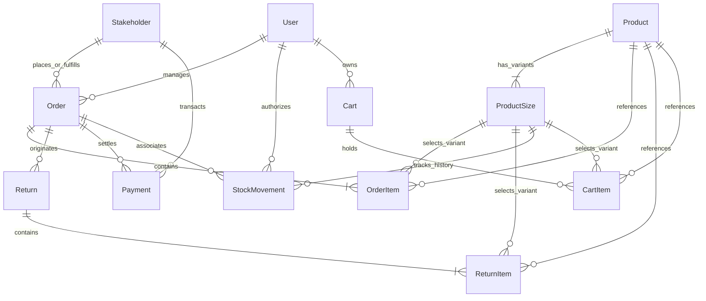

# Warehouse Management System (WMS-2.0) & E-Commerce Platform
## System Specification, Technical Blueprint & Refactored Development Roadmap

> **Document Status:** Refactored & Updated (Reflecting Current System Implementation)  
> **Backend:** Django 5 REST Framework, PostgreSQL, SimpleJWT, WhiteNoise, Docker Compose  
> **Management Portal (WMS):** Vue 3, Vite, PrimeVue 4, Tailwind CSS, Pinia  
> **Customer Storefront:** Nuxt 3, Vue 3, Tailwind CSS  
> **Inventory Standard:** ERP-Grade Single Source of Truth (`ProductSize`) with Audit Trail (`StockMovement`)

---

## Table of Contents
1. [Executive Summary & Architecture Evolution](#1-executive-summary--architecture-evolution)
2. [Functional System Requirements](#2-functional-system-requirements)
   - [2.1 Executive Dashboard & Live Analytics](#21-executive-dashboard--live-analytics)
   - [2.2 Product Catalog & Inventory Model](#22-product-catalog--inventory-model)
   - [2.3 Procurement (Purchase Orders - PO)](#23-procurement-purchase-orders---po)
   - [2.4 Order Fulfillment (Sales Orders - SO)](#24-order-fulfillment-sales-orders---so)
   - [2.5 Payment Settlements & Cash Flow Ledger](#25-payment-settlements--cash-flow-ledger)
   - [2.6 Return Merchandise Authorization (RMA)](#26-return-merchandise-authorization-rma)
   - [2.7 Stakeholder Management (Customers & Suppliers)](#27-stakeholder-management-customers--suppliers)
3. [Data Architecture & Entity Relationships](#3-data-architecture--entity-relationships)
4. [Master TODO & Feature Status Matrix](#4-master-todo--feature-status-matrix)
   - [4.1 Completed Features & Bug Fixes (Audit Verified)](#41-completed-features--bug-fixes-audit-verified)
   - [4.2 In-Progress & Partially Implemented Features](#42-in-progress--partially-implemented-features)
   - [4.3 Pending System Backlog (Things To Do)](#43-pending-system-backlog-things-to-do)
   - [4.4 Phase 2 & Advanced Features](#44-phase-2--advanced-features)
5. [Website Development Roadmap (E-Commerce Storefront)](#5-website-development-roadmap-e-commerce-storefront)
   - [Week 1: Cart + Checkout Flow](#week-1-cart--checkout-flow)
   - [Week 2: Auth, Customer Profile & Storefront Polish](#week-2-auth-customer-profile--storefront-polish)
   - [Week 3: Security, Hardening & Production Launch](#week-3-security-hardening--production-launch)
6. [Next Immediate Engineering Actions](#6-next-immediate-engineering-actions)

---

## 1. Executive Summary & Architecture Evolution

The original WMS document defined initial specifications for warehouse operations, an 11-item post-development TODO list, Phase 2 goals, and a 21-day storefront roadmap. 

Since the initial draft, the system has undergone significant architectural enhancements:
1. **ERP Inventory Redesign (SAP/Odoo Standard):** Inventory is no longer tracked through denormalized counters on `Product`. Real-time stock is maintained exclusively on variant-level `ProductSize`, with every quantity alteration logged as an immutable `StockMovement` audit record.
2. **Financial Debt Liquidation Engine:** Support for stakeholder `opening_balance`, automated FIFO order debt deduction, overpayment guards, and direct opening balance settlements without linked orders.
3. **Database Modernization:** Migrated to PostgreSQL with full Docker Compose orchestration and environment configuration.
4. **WMS Frontend Redesign:** UI refreshed with responsive Tailwind layouts, dark/light theme switching, PrimeVue components, interactive product catalog picker with variant selection modals, down-payment integration, and full breadcrumbs hierarchy.
5. **Storefront (Nuxt 3):** Backend cart APIs and frontend `/cart` UI with size selection and real-time totals completed.

---

## 2. Functional System Requirements

### 2.1 Executive Dashboard & Live Analytics
- **Live Performance Indicators:**
  - Real-time aggregation of total products, active customers, active suppliers, and overall inventory valuation.
  - Sales Pipeline: Gross sales turnover, collected receivables, and outstanding customer debt.
  - Procurement Pipeline: Total purchase commitments, settled payables, and outstanding vendor dues.
- **Visual Analytics:**
  - Product stock availability distribution chart.
  - Monthly gross turnover comparison (Sales vs Purchase).
  - Cash flow breakdown: Inflows (Receipts) vs Outflows (Disbursements).
- **Navigation & Drill-down:**
  - One-click routing from dashboard metrics directly to filtered operational listing pages (`/orders`, `/stakeholders`, `/stocks`, `/payments`).

### 2.2 Product Catalog & Inventory Model
- **Product Definition:** Name, SKU/Product ID (`PR{id}`), primary image, unit of measurement (`Pieces`, `Kilograms`, `Sets`), selling price, and base cost.
- **Variant Size Matrix (`ProductSize`):**
  - Granular sizing with specific prices and independent stock levels (`stock`).
  - Total available product quantity (`qty_available`) computed dynamically:
    $$\text{qty\_available} = \sum_{\text{size} \in \text{sizes}} \text{size.stock}$$
- **Audit Trail (`StockMovement`):**
  - Automatic audit ledger tracking movement type (`PURCHASE`, `SALE`, `RETURN_SALE`, `RETURN_PURCHASE`, `ADJUSTMENT`, `TRANSFER`), quantity delta ($+$ for inbound, $-$ for outbound), reference order ID, and timestamp.
- **Catalog Management:**
  - Inline row editing for product information.
  - Add/Edit product dialog with dynamic size matrix creator.

### 2.3 Procurement (Purchase Orders - PO)
- **Order Manifest:** Selection of active Supplier, PO number auto-generation (`PO-YYMM-XXX`), issue date, and itemized lines.
- **Stock Inbound Receiving:** Upon PO item creation, corresponding `ProductSize.stock` increments atomically, and an inbound `PURCHASE` stock movement is logged.
- **Financial Calculation:**
  - Line Total: $\text{quantity} \times \text{unit\_price}$
  - Gross Amount: $\sum \text{Line Totals}$
  - Net Amount: $\text{Gross Amount} - \text{Supplier Discount}$
  - Initial Balance Due: Defaults to $\text{Net Amount}$.
- **Initial Advance Payment:** Option to record an immediate upfront disbursement during order creation.
- **Cancellation:** Atomic reversal of PO items (checks that warehouse stock has not already been consumed before decrementing and logging `ADJUSTMENT`).

### 2.4 Order Fulfillment (Sales Orders - SO)
- **Interactive Catalog UI/UX:**
  - Product catalog browse view with search and category filtering.
  - Modal picker for selecting product variant size, validating real-time warehouse stock, and confirming unit sale price.
- **Stock Allocation & Row Locking:**
  - Database row-level locking (`select_for_update`) during order submission to prevent race conditions or overselling.
  - Immediate stock decrement on `ProductSize.stock` and logging of `SALE` stock movement.
- **Financial Calculation:**
  - Gross amount aggregation, customer discount deduction, and net total derivation.
  - Down-payment/Advance receipt interface on creation.
- **Cancellation:** Restores allocated stock back to `ProductSize` and creates an audit `ADJUSTMENT` movement.

### 2.5 Payment Settlements & Cash Flow Ledger
- **Classification:**
  - `INBOUND`: Customer receivables collection.
  - `OUTBOUND`: Supplier procurement disbursement.
  - `REFUND`: Customer return reimbursement.
- **Debt Allocation Mechanics:**
  - **Specific Order Payment:** Allocates payment directly against an order's `pending_amount`. Auto-closes order (`order_status = 'Closed'`) when pending balance reaches zero.
  - **Stakeholder Account Payment (No Order Linked):** Liquidates stakeholder `opening_balance` first. Any remaining payment is automatically applied FIFO to the stakeholder's oldest outstanding bill.
- **Validation:** Payment amount cannot exceed total outstanding liabilities (prevents overpayment).
- **Cash Flow Analytics:** Dedicated `financial_summary` endpoint providing 30-day collection velocity, today's collections/disbursements, and 6-month monthly trends.

### 2.6 Return Merchandise Authorization (RMA)
- **Eligibility:** Returns permitted only on valid, non-cancelled orders (`Issued`, `Delivered`, `Recieved`, `Closed`). Closed bills allowed for valid RMA.
- **Item Validation:**
  - Return items must originate from the referenced order.
  - Cumulative returned quantity across all return instances cannot exceed ordered quantity:
    $$\sum \text{ReturnItem.qty} \le \text{OrderItem.qty}$$
- **Condition Grading & Quarantine:**
  - Conditions: `Good`, `Damaged`, `Expired`, `Defective`, `Wrong Item`.
  - Sales Return (`SR`): `Good` or `Wrong Item` automatically restocks sellable warehouse inventory. `Damaged`, `Expired`, or `Defective` items are routed to quarantine without inflating sellable inventory.
  - Purchase Return (`PR`): Decrements warehouse stock and checks available quantity before approval.
- **Financial Adjustment:**
  - Deducts total return value from original order's `total_amount` and `pending_amount` atomically upon approval.

### 2.7 Stakeholder Management (Customers & Suppliers)
- **Profile Directory:** Company name, contact person, mobile, email, billing address, shipping address, tax details (GSTIN, PAN), credit limit, and payment terms.
- **Opening Balance Integration:** Allows entering pre-existing opening balance upon creation, which automatically enters the pending receivable/payable ledger.
- **Status Lifecycle & Deactivation:**
  - Active/Inactive toggle button (`is_active` / `is_deleted`).
  - Filtering by Active vs Inactive stakeholders.
- **Referential Integrity Guard:** Permanent deletion blocked if stakeholder is linked to orders, returns, payments, or unsettled balances; prompts user to deactivate instead.
- **Detailed Stakeholder Ledger:** Single view displaying contact details, active credit, opening balance, pending orders, settled orders, and exportable transaction history.

---

## 3. Data Architecture & Entity Relationships

### Relational Schema Summary:
1. **`Stakeholder (1) → Order (M)`**: A customer or supplier holds multiple sales or purchase orders.
2. **`Stakeholder (1) → Payment (M)`**: Payments link directly to stakeholders (for balance settlements) or via orders.
3. **`Product (1) → ProductSize (M)`**: Each product has one or more size variants with independent stock and pricing.
4. **`ProductSize (1) → StockMovement (M)`**: Complete transactional audit trail for every inventory addition, deduction, and transfer.
5. **`Order (1) → OrderItem (M)`**: Line items define product, chosen `ProductSize`, quantity, unit price, and total.
6. **`Order (1) → Return (M)`**: Multiple return vouchers can be issued against a single order up to the order's item quantities.
7. **`Return (1) → ReturnItem (M)`**: Itemized return manifest with condition grading and quarantine status.
8. **`Cart (1) → CartItem (M)`**: Persistent storefront customer carts linking items to product size variants.

---

## 4. Master TODO & Feature Status Matrix

### 4.1 Completed Features & Bug Fixes (Audit Verified)
*All items below have been fully developed, tested, and verified in the codebase.*

| # | Item from Initial Doc | Implementation Proof & Technical Solution | Status |
|---|---|---|---|
| 1 | **Hide Closed Bills from create return screen** | Validated in `returns/create.vue` and `api/v1/inventory/views.py`. Orders with 100% returned items are excluded from new return manifests. | ✅ Complete |
| 2 | **Navigate to order from return screen** | Implemented in `returns/index.vue` and `returns/[id].vue` via router links to `/orders/${return.original_order.id}`. | ✅ Complete |
| 3 | **Navigation to section from dashboard** | Implemented in `home/index.vue`. Summary KPI cards and pipeline banners link directly to `/orders`, `/stocks`, and `/stakeholders`. | ✅ Complete |
| 4 | **Payment statistics filter bug** | Fixed in `PaymentViewSet` via `DjangoFilterBackend`, month extraction annotations, and `financial_summary` endpoint. | ✅ Complete |
| 5 | **Deactivate button for customer / supplier** | Implemented in backend (`toggle_status` action in `StakeholderView`) and frontend `stakeholders/index.vue` with confirmation dialog. | ✅ Complete |
| 6 | **Filter for Active and Inactive listing page** | Implemented in `stakeholders/index.vue` with `statusOptions` (`All`, `Active Only`, `Inactive Only`). | ✅ Complete |
| 7 | **Transaction bar update in Stakeholder view** | Resolved in `stakeholders/[id].vue` by displaying clean total transactional metrics and settled vs pending balances. | ✅ Complete |
| 8 | **Opening balance category in Stakeholder** | Added `opening_balance` to `Stakeholder` model, included in `AddStakeHolderModal.vue`, and added to `total_pending_amount`. | ✅ Complete |
| 9 | **Manage payment of stakeholder with opening balance** | Implemented in `Payment.save()`. Unallocated payments deduct from `opening_balance` before applying to oldest orders. | ✅ Complete |
| 10 | **Login bug fix** | Fixed in `accounts/views.py` and simple JWT / session authentication workflows. | ✅ Complete |
| 11 | **Change DB to PostgreSQL** | Fully completed. Configured in `compose.yaml`, `requirements.txt` (`psycopg2-binary`), and settings database routing. | ✅ Complete |
| 12 | **Initial amount pay interface on add orders** | Implemented in `orders/create.vue`. `downPayment` input automatically creates and links a `Payment` voucher upon order creation. | ✅ Complete |
| 13 | **Add opening balance to receivable statistics** | Implemented in `StakeholderView.stats` and `PaymentViewSet.financial_summary`. | ✅ Complete |
| 14 | **Change sales order UI/UX (catalog & modal)** | Implemented in `orders/create.vue`. Visual product catalog, variant selection modal with live stock check, and confirmation modal. | ✅ Complete |
| 15 | **Products Add/Edit section** | Implemented in `stocks/index.vue` with `AddProductModal.vue`, inline table editing, and variant management dialog. | ✅ Complete |
| 16 | **Refetch orders after adding new order** | Implemented across order and return flows using reactive event emits (`@instance-added`). | ✅ Complete |
| 17 | **Qty purchased & stock changes on order placed** | Implemented in `OrderItem.save()` and `StockMovement` creation adhering to ERP standards. | ✅ Complete |
| 18 | **Outstanding payable amt mismatch** | Fixed in atomic calculation routines and financial summary endpoint. | ✅ Complete |
| 19 | **Click on statistics consistency** | Verified across all dashboard KPI cards and route navigations. | ✅ Complete |
| 20 | **Breadcrumbs for each page (Phase 2 item)** | Implemented in `Breadcrumbs.vue`, `breadcrumbs.ts`, and mounted in `Header.vue`. | ✅ Complete |

---

### 4.2 In-Progress & Partially Implemented Features

| # | Feature / Task | Current Progress | Remaining Work Needed | Priority |
|---|---|---|---|---|
| 1 | **Company dropdown filtering by order/payment type** | Implemented in `orders/create.vue` (SO shows Customers, PO shows Suppliers). | Update `AddPaymentModal.vue` to filter stakeholder dropdown based on `payment_type` (`INBOUND` → Customers, `OUTBOUND` → Suppliers). | High |
| 2 | **Payment Reports & Ledgers** | `financial_summary` API provides cash flow metrics and monthly trends. Payments table has CSV export. | Add a dedicated PDF/Excel statement generator for individual stakeholder ledgers and date-range settlement reports. | Medium |
| 3 | **Low Stock Alerts** | `stocks/index.vue` has filter tags for `Low Stock (1-10)` and `Out of Stock (0)`. | Add global badge indicator in `Header.vue` and an alert card on the main dashboard (`home/index.vue`). | High |
| 4 | **Responsive Tablet & Mobile Layout** | WMS management portal refactored with responsive sidebar drawer and fluid grids. | Complete mobile viewport testing on the Nuxt 3 storefront (`website/`). | Medium |
| 5 | **Reverse Proxy & Deployment Prep** | Docker Compose and Vercel configuration files exist. | Create standardized production Nginx configuration file with SSL, Gunicorn systemd unit, and static/media routing. | High |

---

### 4.3 Pending System Backlog (Things To Do)

| # | Feature / Task | Technical Scope & Implementation Plan | Complexity |
|---|---|---|---|
| 1 | **Test Data Generation Command** | Create a custom Django management command: `python manage.py generate_test_data --products=50 --orders=100`. Seeds realistic stakeholders, size variants, stock movements, and orders. | Low |
| 2 | **Product Purchase / Sales Price History** | Create a price audit log or query interface aggregating historical prices from `OrderItem` by date to display price fluctuation graphs. | Medium |
| 3 | **Edit Payments Workflow** | Formulate accounting policy: Payments should be immutable for financial audit compliance. Add a "Void / Cancel Voucher" action that reverses balances rather than direct edits. | Medium |
| 4 | **Sales Forecasting Module** | Implement a 30-day moving average or linear regression algorithm using historical `Order` data to project upcoming demand per product category. | High |
| 5 | **Stock Entry Sample Sheet Download (Phase 2)** | Add a button in `stocks/index.vue` to download a standardized CSV/Excel template for bulk inventory upload, along with an import parser. | Low |
| 6 | **Margin Calculations (Phase 2)** | In orders and analytics, compute line-item margin and gross order margin: $$\text{Margin \%} = \frac{\text{Selling Price} - \text{Purchase Price}}{\text{Selling Price}} \times 100$$ | Low |

---

## 5. Website Development Roadmap (E-Commerce Storefront)

The customer-facing website (`website/`) is built with **Nuxt 3** and communicates with the WMS backend REST APIs.

### Week 1: Cart + Checkout Flow
- [x] **Day 1 – Cart Backend Completion:** REST endpoints for `Cart` and `CartItem` (`GET`, `POST`, `DELETE`, update quantity).
- [x] **Day 2 – Cart Page UI:** Vue template in `website/app/pages/cart.vue` with product thumbnails, size labels, unit price, quantity steppers, remove buttons, and subtotal.
- [x] **Day 3 – Cart Logic Integration:** Connected frontend to `/api/inventory/cart/` with debounced quantity adjustments and empty state handling.
- [ ] **Day 4 – Checkout Page UI:**
  - Create `website/app/pages/checkout.vue`.
  - Customer shipping form (Full Name, Phone, Email, Shipping Address, City, State, Postal Code).
  - Order summary sidebar with itemized variants, delivery fee calculation, and grand total.
- [ ] **Day 5 – Order Backend (Storefront Order Placement):**
  - Create dedicated endpoint `POST /api/inventory/storefront/checkout/`.
  - Converts active cart into an issued Sales Order (`Order` + `OrderItem` linked to size variants).
  - Automatically matches or creates a Customer `Stakeholder` record based on phone/email.
  - Clears user's cart upon successful order creation within an atomic database transaction.
- [ ] **Day 6 – Order Confirmation & Feedback:**
  - Create `website/app/pages/order-success.vue`.
  - Display confirmation badge, generated order number (`SO-XXXXXX`), customer contact summary, and payment instructions.
- [ ] **Day 7 – End-to-End Cart & Checkout Verification:**
  - Verify complete lifecycle: Browse catalog → Add size variant to cart → Checkout → Verify warehouse stock decrements in WMS.

### Week 2: Auth, Customer Profile & Storefront Polish
- [x] **Day 8 – Auth Backend:** JWT login and registration endpoints (`/api/auth/login/`, `/api/auth/register/`).
- [ ] **Day 9 – Storefront Auth UI:**
  - Create customer login and registration modal/pages in Nuxt.
  - Store JWT tokens securely with auto-refresh on 401 response.
- [ ] **Day 10 – User Profile & Order History:**
  - Create `website/app/pages/profile.vue` and `website/app/pages/orders/index.vue`.
  - Allow logged-in customers to view past orders and fulfillment statuses (`Issued`, `Delivered`).
- [ ] **Day 11 – Admin / Fulfillment Bridge:**
  - Connect storefront order status changes directly to WMS order dispatch workflow.
- [ ] **Day 12 – UI Polish & Micro-Interactions:**
  - Add toast notifications on "Add to Cart", button loading spinners, and skeleton loaders for product detail views.
- [ ] **Day 13 – Storefront Mobile Responsiveness:**
  - Optimize sticky mobile bottom navigation, cart slide-over drawer, and touch-friendly controls.
- [ ] **Day 14 – SEO & Performance:**
  - Dynamic OpenGraph and Twitter meta tags for product pages using Nuxt `useSeoMeta`.
  - Image optimization and Lighthouse performance audit.

### Week 3: Security, Hardening & Production Launch
- [ ] **Day 15 – Security & Access Control:**
  - Validate DRF API permissions (`AllowAny` on public catalog/cart vs `IsAuthenticated` on private orders).
  - Rate limiting (throttling) on checkout and login endpoints.
- [ ] **Day 16 – Error Handling & Edge Conditions:**
  - Display friendly error messages for out-of-stock items at the checkout boundary.
  - Network disconnection and retry banners.
- [ ] **Day 17 – Deployment Preparation:**
  - Configure production environment variables (`.env.production`).
  - Configure CORS allowed origins between backend domain and storefront domain.
- [ ] **Day 18 – Backend Production Deployment:**
  - Deploy PostgreSQL and Django application via Docker / Railway / VPS.
  - Run database migrations and static collection (`collectstatic`).
- [ ] **Day 19 – Frontend Production Deployment:**
  - Deploy Nuxt 3 storefront on Vercel / Netlify with SSR/Node preset.
  - Connect custom domain and configure HTTPS certificates.
- [ ] **Day 20 – Final End-to-End Regression Testing:**
  - Comprehensive checkout, return, inventory sync, and multi-device testing.
- [ ] **Day 21 – Launch Day 🎉:**
  - Live DNS cutover, monitoring activation, and project sign-off.

---

## 6. Next Immediate Engineering Actions

To maintain velocity, the engineering team should tackle tasks in the following recommended sequence:

1. **Sprint 1 (Immediate - 1-2 Days):**
   - Filter stakeholder dropdown in `AddPaymentModal.vue` based on selected `payment_type`.
   - Add low stock alert notification badge in `Header.vue` and dashboard warning widget.
   - Build Django management command `python manage.py generate_test_data`.

2. **Sprint 2 (Storefront Checkout - 3-4 Days):**
   - Implement `website/app/pages/checkout.vue` and `order-success.vue`.
   - Implement `POST /api/inventory/storefront/checkout/` endpoint to convert cart to Sales Order.

3. **Sprint 3 (Reporting & Tooling - 2-3 Days):**
   - Implement downloadable stock entry sample CSV and bulk upload view.
   - Implement gross margin calculation in order summaries.
   - Add PDF/Excel export for stakeholder payment statements.
